

# PublishingLab Manual     2016/2017

<h4 class="nomargintop">Table of Contents</h4>

- [About](#about) <!--header-->
	- [Who We Are](#whoarewe)
	- [Team](#team)
	- [Who Our Interns Are](#whoourinternsare)
	- [Who Our Partners Are](#whoourpartnersare)
	- [What We Do](#whatwedo)

- [Showcases](#showcases) <!--header-->
	- [Transforming Hit 'n' Run Millennials](#persgroep)
	- [Institute of Network Cultures](#INC)
	- [UNStudio](#unstudio)

- [Design Approach - SCREAM!](#process) <!--header-->
	- [SCREAM! Process](#SCREAM!)
	- [Design Process](#designprocess)
	- [Research, Translate And Create](#researchtranslatecreate)
	- [Design Sprints](#sprints)
	- [Rituals](#rituals)
	- [Roles](#roles)
	- [Competences](#compentences)
	- [Workshops, Masterclasses and Lectures](#workshops)

- [Program](#programme) <!--header-->

- [Lab](#lab) <!--header-->
	- [Multidisciplinary And Multicultural Teamwork](#teamwork)
	- [Language](#language)
	- [Styles of Communication](#communication)
	- [In Case of Conflict](#conflict)
	- [Presenting Your Work](#presenting)
	- [Blog](#blog)
	- [Sharing, Working And Documentation](#documentation)

- [Resources](#resources) <!--header-->
	- [Hybrid Publishing Workflow](#HPW)
	- [UX Principles](#UX)
	- [Code](#code)

- [Practical Info](#practicalinfo) <!--header-->
- [Schedule](#schedule)
- [Deliverables](#deliverables)

## About
Welcome to the [PublishingLab](http://publishinglab.org), this section tells you a bit about who we are, who our interns are and who our partners are. You will also find an overview of what we do.

### Who are we
The PublishingLab is an applied research lab in the field of hybrid publishing working at the intersection of publishing and digital technology, both in print and on screen. We are part of the Amsterdam Creative Industries Network (ACIN) and the Amsterdam University of Applied Sciences. The world of digital publishing has been growing steadily for several years. The arrival of tablets and smartphones has accelerated these developments, and today it is impossible to imagine a media landscape without e-books, newspaper apps, and digital magazines. Digitalization is turning the field upside down! This is where the PublishingLab comes in.

The PublishingLab is part of [ACIN](http://www.amsterdamcreativeindustries.com), the national talent, knowledge and business network for creative industry and digital technology. ACIN was founded by the Amsterdam University of Applied Sciences, the Amsterdam School of the Arts and Inholland University of Applied Sciences. ACIN currently hosts eleven other labs such as Art&Technology lab, Fashion&Technology lab, Gamelab, etc. PublishingLab is based in Benno Premselahuis, at the School of Design & Communication from the Amsterdam University of Applied Sciences. Students, teachers and researchers work together on applied research with the creative industries and the ICT sector. The results will be used in curriculum development and consulting the industry. Together with the [Institute of Network Cultures](http://networkcultures.org) (INC), PublishingLab is located on the Amstelcampus Amsterdam.

### Team

Dylan Degeling 
Best described as a Digital Designer with an affection for hybrid publishing, open source, and coding. I Hold a BA in Communication & Multimedia Design from the Rotterdam University of Applied Sciences - with a minor+ in Open Design from the Willem de Kooning Academy. Within the PublishingLab I mainly work on the design and development of a project with the HvA/UvA library that focusses on creating proper EPUBs from academic papers. Outside of the PublishingLab I spend most of my time making and listening to music.

 Lucia Dossin 
I have a background in design and development for the web, hold a BA in Architecture and Urbanism from FAUUSP (Brazil) and a MA in Media Design and Communication from Piet Zwart Institute, Rotterdam. Interested in hybrid publishing and in mixing inputs and outputs.

 Rose Leighton 
I combine two positions at the Hogeschool van Amsterdam, University of Applied Sciences.
As a lecturer, I introduce students into the world of international trade publishing. I have worked in the book publishing industry and now lecture on that subject for the Media, Information & Communication Programme. As Researcher at the PublishingLab, I look into ways of publishing books (mostly eTextbooks) and curating learning materials in hybrid ways, for example in the Bundle project.

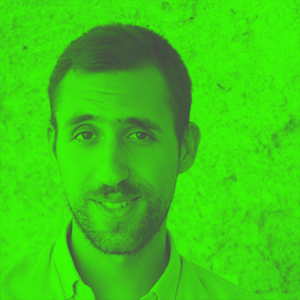 Silvio Lorusso 
I'm an Italian artist, designer, and researcher interested in the complicated relationship between technology and society. I hold a Ph.D. in Design Sciences from the School of Doctorate Studies – Iuav University of Venice. I took part in exhibitions and events such as Transmediale (Berlin, Germany), Impakt (Utrecht, Netherlands), Off the Press (Rotterdam, Netherlands), Adhocracy (Athens, Greece). My writing has appeared in Prismo, Printed Web 3, Metropolis M, Progetto Grafico, Digicult, Diid, and Doppiozero.

 Margreet Riphagen 
My interest lies in combining facilitating an area where students can conduct experiments within the field of publishing, as well as doing own research. I’m coordinator of the PublishingLab, and was the coordinator of the two-year research project Hybrid Publishing Toolkit I hold a BA in Integrated Communication Management at the Hogeschool of Utrecht (2000). Post-BA in Business Science (2009) and a MSc in Information Science (2013). Before the HvA I worked at Waag Society as a producer. I love looking at graphic design, and I’m always up for good coffee. 

### Other Advisors Available from the Institute of Network Cultures

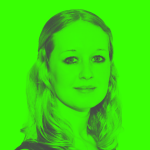 Leonieke van Dipten 
After conducting an internship about Art Criticism I’m started beginning of September as a project manager at the Institute of Network Cultures. I hold a BA in ArtEZ Institute of Arts and a MA in New Media and Digital Culture at the University of Utrecht.

 Inte Gloerich 
After studying Graphic Design, I acquired a BA in Film Studies and an MA in New Media and Digital Culture at the University of Amsterdam. Fascinated by the political and societal implications of digital phenomena, I focussed on the construction of political issues on Twitter during election time. I worked for the Publishing for one and a half year and am working at Institute of Network Cultures now. I am interested in topics like open research publishing, hybrid publishing and online journalism.

 Geert Lovink 
Geert Lovink is a media theorist, internet critic and author of Dark Fiber (2002), Zero Comments (2007), Networks Without a Cause (2012) and Social Media Abyss (2016). Since 2004 he is researcher in the Faculty of Digital Media and Creative Industries at the Amsterdam University of Applied Sciences (HvA) where he is the founder of the Institute of Network Cultures. His centre recently organized conferences, publications and research networks such as Video Vortex (the politics and aesthetics of online video), Unlike Us (alternatives in social media), Critical Point of View (Wikipedia), Society of the Query (the culture of search), MoneyLab (internet-based revenue models in the arts) and a project on the future of art criticism. From 2004-2013 he was also associate prof. at Mediastudies (new media), University of Amsterdam. Since 2009 he is professor at the European Graduate School (Saas-Fee/Malta) where he supervises PhD students.

 Miriam Rasch 
With my background in literature and philosophy you may call me a true lover of words. At the Institute of Network Cultures I’m responsible for our publication series, which are published both on paper, in digital formats and online. As a part of the research team for the Hybrid Publishing Toolkit I helped (re)design the hybrid publishing workflow, which is now implemented in the INC. At the PublishingLab I coordinated the Art of Criticism project and hope to pursue many publishing questions in the future to come.

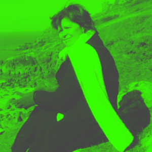 Sonja van der Valk 
Once I had a dream and when I discovered more people shared the same dream, the laboratorium and the academy for arts criticism was born. Nowadays called Stichting Domein voor Kunstkritiek. 
I’m also teacher and advisor of the Education Theater lecturer, as well as chairman of the Dutch Theater Association which yearly organizes the Marie Kleine-Gartman essay price. 

### Who our interns are
PublishingLab works with students from different backgrounds, offering a wide range of opportunities to its students – from experimenting with digital publishing workflows to testing user interface design. We like to work with students who don’t give up easily; who like experimenting with text, typography, code, (moving) images and the opportunities that digital media provide. We work with students with design, hacking, writing and many other skills; the teams are multidisciplinary and selected to fit the needs of the project. We’re looking for motivated students who respond to opportunities and challenges intelligently, creatively and want to push the boundaries of hybrid publishing.

### Who our partners are
PublishingLab works with various partners, ranging from government institutions, Dutch SMEs, and large international corporations in the field of digital media and publishing. Our projects are always shaped in co-creation with our partners. Working with partners means the PublishingLab has a good network in Amsterdam's creative industries. Recent partners include De Persgroep Nederland, De Persgroep Digitaal, WeekbladpersGroep, UNStudio, Canon, Cinekid, Hogeschool Bibliotheek Amsterdam, Het Vlaams-Nederlands platform Laboratorium Actuele Kunstkritiek, Domein voor Kunstkritiek, rekto:verso, Archined, Piet Zwart Institute and many others.

### What We Do
The PublishingLab conducts applied research by doing innovative experiments in the field of (digital) publishing. This includes research on the impact of developments on the branch as a whole, conducting small experiments in the field of EPUB3 (such as research/work on user interface design for collaborative online editing environments), research/work on conveying hybrid publishing concepts and work flows to a non-expert audience or experiments that aim to solve interesting design problems.

## Showcases
The following showcases are developed in close collaboration between students and researchers from the PublishingLab and a partner from the creative industries.

### Transforming Hit 'n' Run Millennials - De Persgroep (2016)
<!-- title (year) -->

<!--appealing image-->

  

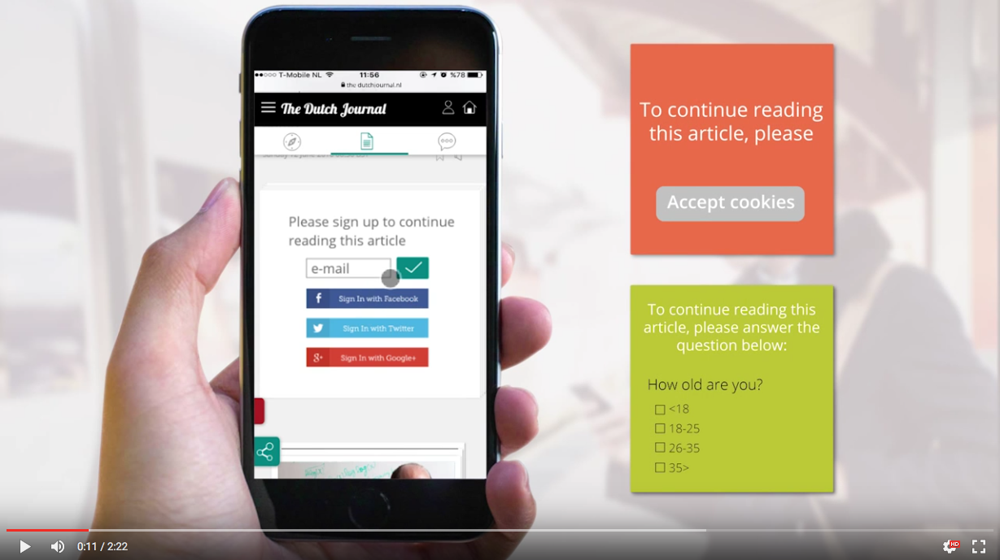

Screenshot of conducted survey about prototype.
 

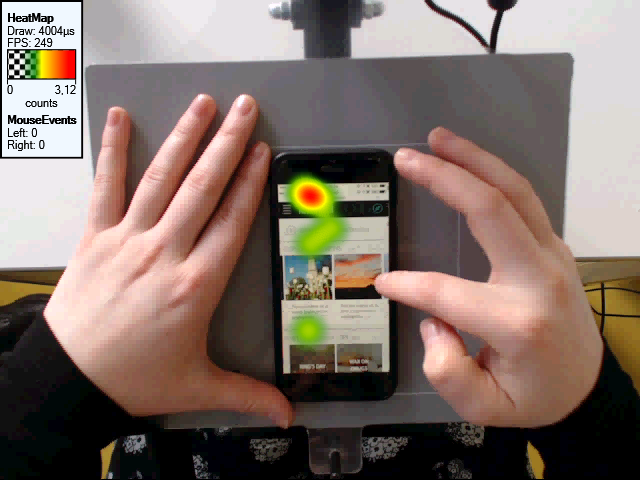

Heatmap of testing the prototype.
 

<!--challenge / research question:-->
**Challenge**: How can De Persgroep build sustainable relationships with millennial readers that arrive to their articles through social media links?

<!--short alinea what the project is about-->
**Solution**: De Persgroep notices that many visits to their sites can be characterized as 'hit 'n' run'; the reader clicks on a link in their Facebook timeline or Twitter feed, reads 1 article while hardly being aware of the site it is part of, and leaves without any promise of returning. They want to find innovative ways of taking this first moment of interaction between a new reader and their brand further and build a sustainable relationship.

<!--team-->
**Team**:

- Belen Muñoz (ES) University of Amsterdam, MA New Media & Digital Culture
- Ilayda Ṣarlak (TR) Utrecht University, MA New Media & Digital Culture
- Alina Niemann (DE) University of Amsterdam, MA New Media & Digital Culture
- Inte Gloerich (NL) (PublishingLab coach)
- Lucia Dossin (BR) (PublishingLab support)

<!--url-->
**Link**: [Transforming Hit 'n' Run Millennials](http://www.publishinglab.nl/transforminghnrmillennials/)

<!--connect research paper-->
Millennials grew up in a world of free online news; news sites sold ads to companies and readers payed with their attention and clicks instead of their money. With the advent of adblockers and overall disappointing ad effectiveness, this exchange isn't as profitable as it once was imagined to be. News sites the world over are struggling to keep afloat and engaging a new generation of readers seems essential in acchieving this. If millennials won't commit to one medium and pay a substantive subscription fee, what are innovative ways for news sites to make their product profitable and sustainable?

<!--partner(s)-->
**Partner**: 

### Navigating Theory on Demand - Institute of Network Cultures (2015)
<!-- title (year) -->

  

<!--appealing image-->
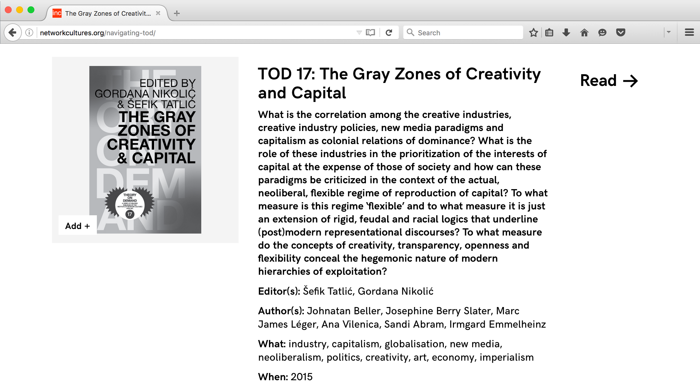

Screenshot of webpage Navigationg Theory on Demand.
 

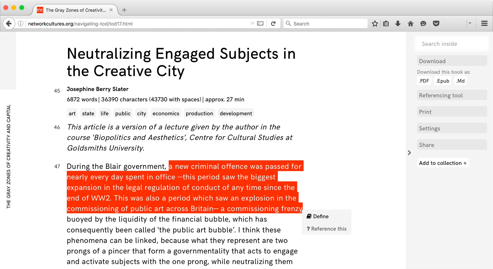

Screenshot of highlighting in webpage Navigationg Theory on Demand.
 

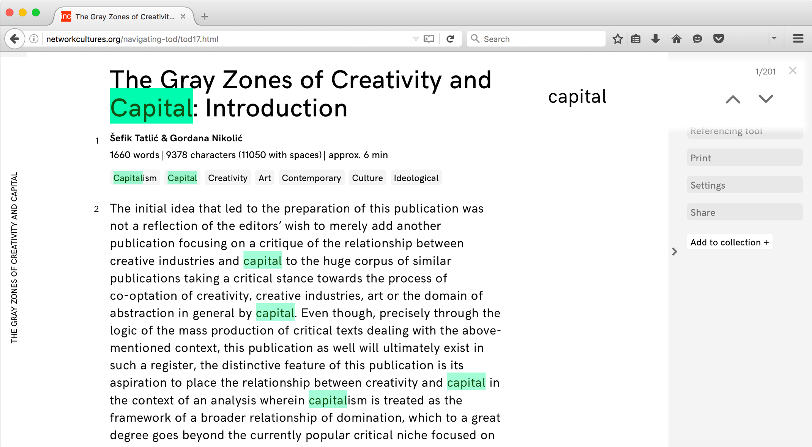

Screenshot of searching in webpage Navigationg Theory on Demand.
 

<!-- challenge / research question: -->
**Challenge**: How do we maximize efficiency and co-existence of the various formats (epub, print, HTML) for the INC 'Theory on Demand' series?

<!--short alinea what the project is about-->
**Solution**: The 'Theory on Demand' series is currently hosted on the INC website, which, unfortunately, is lacking a comprehensive searching tool or a filter to access the content of the publication. Although the current website has favorable esthetics, it functions as a static and non-navigable platform. What can an ideal (and effective) academic publication look like in the digital realm?

<!--team-->
**Team**:

- Léna Robin (FR) Haute École des Arts du Rhin, MA Visual Expression in Graphic Communication
- Josip Batinic (HR) University of Amsterdam, MA New Media and Digital Culture
- Inte Gloerich (PublishingLab coach)
- Gottfried Haider (PublishingLab support)
- Lucia Dossin (PublishingLab support)

<!--url-->
**Link**: [Navigation Theory on Demand](http://www.publishinglab.nl/navigating-tod/)

<!--connect research paper-->
The project task involved adapting the already existing print and static content of the INC’s ‘Theory on Demand’ series onto the digital screens, more precisely, creating a fully digital version of the book, making use of the advantages and the possibilities of the web-page format. It can be seen as existing in the context of other innovative online publications such as [Open!](http://www.onlineopen.org/index.php) and [Fold](http://www.onlineopen.org/index.php).

<!--partner(s)-->
**Partner**: 

### Knowledge Matters, Interactive Book App - UNStudio (2015)

<!-- title (year) -->

<!-- challenge / research question: -->
**Challenge**: How can an interactive experience help a reader understand the architectural principles underpinning 25+ years of work and research in a way that print can’t?

<!-- short alinea what the project is about -->
**Solution**: Knowledge Matters web app is a digital extension of a printed book by UNStudio, that represents the Arnhem Station project as an interactive experience. It is divided in two ways of navigating through the content, based on time.
The 'fast' mode is a selection of material thought to be presented as highlights of the project. It is a linear narrative, presented within a chronological order, as a timeline. The 'slow mode' offers more detailed information on the project which fits the 'academic' type of user, who is searching for in-depth knowledge. A non-linear menu allows the user to make intuitive choices and construct his own story.

<!-- team -->
**Team**:

- Joana Chicau (PT) Piet Zwart Institute Rotterdam, MA Media Design and Communication
- Anastasia Kubrak (RU) Design Academy Eindhoven, BA Media & Culture Design
- Wahid Nawzadi (NL) HAN University of Applied Sciences, BA Communication &  Multimedia Design
- Karina Zavidova (RU) Royal Academy of Art The Hague, BA Graphic Design
- Jess van Zyl (PublishingLab coach)
- Gottfried Haider (PublishingLab support)
- Lucia Dossin (PublishingLab support)

<!-- url -->
**Link**: [Knowledge Matters, UNStudio](http://www.publishinglab.nl/unstudio/)

Screenshot of web app Knowledge Matters.
 

Screenshot of web app Knowledge Matters.
 

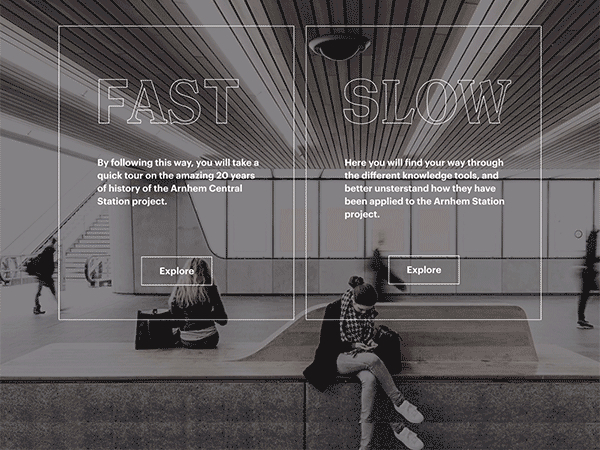

Screenshot of web app Knowledge Matters.
 

<!-- connect research paper -->
The goal of the interactive book ‘Knowledge Matters’ was to design an extension of a printed book: maybe a digital book? While analyzing and selecting material from the digital archive of UNStudio and becoming aware of its potential, we understood that a new approach had to be considered. Maybe not a mere translation between a printed matter and a digital one, but instead an exploration of the digital format in a way that would not be possible in the printed form.
We decided to create an app that would enhance the non-linear quality of the navigation and give priority to material in motion and interacte features. A combination of programming languages (HTML5, CSS and Javascript), together with graphic studies, shared motivation and enthusiasm made ‘Knowledge Matters’ a very unconventional book.

<!-- partner(s) -->
**Partner**: 

## Design Approach - SCREAM!
This section explains how we work: the process and design approach for completing your project. This method is borrowed from the [MediaLAB Amsterdam](http://medialabamsterdam.com/) SCREAM! Design Approach, which is a problem-solving method that helps create and evaluate solutions in response to challenges. 

Making teams effective and creative for complex challenges in a digital era. In an ideal design process there is a constant flow between researching and creating. SCREAM! facilitates this flow with a structured ‘common language’ for multidisciplinary design teams. MediaLAB Amsterdam introduces the SCREAM! approach that enables multidisciplinary teams (with members from various business units and background) to get started and structure their design and creative process. Teams work in short design sprints using the best elements of SCRUM [^SCRUM], supplemented by more design related rituals and artefacts that foster the creativity and human-centeredness along the way.  SCREAM! is therefore introduced in combination with the structured Design Method Toolkit, and the SCREAM app that will enable teams to plan and apply design methods in their projects, and create impactful solutions within short iterations. 

### Design Process
The MediaLAB Amsterdam design process helps create and evaluate solutions in response to challenges. In the process MediaLAB intends to evoke real curiosity in order to make students feel highly motivated to find answers and solutions. This involves lots of iterations, making, prototyping, going out on field studies and test each idea, concept or prototype with actual users.

### Research, Translate And Create
At the start of every design challenge, and at the start of each new phase in the design process, research has a central role. Research provides plenty of insights; how people act/think/feel and who the intended users are, within the context of the challenge.
These insights are the key to a solution, but they have to be translated into actual design requirements: which are key for the optimal solution? This is something that can be decided based on the research, and implemented and tested by creating a prototype. A next step might be to research again into what you created by setting up a test with users. During the project there is a constant two-way flow: from research, translation to creation, and from creation, translation to research.

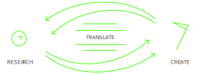

Figure 1. MediaLAB Amsterdam Design Process, Research, Translate and Create phase (source: Manual MediaLAB Design Process 2014).

<!--image of bad quality, but gives an idea of what is desired. change icons.-->

### Design Sprints
SCREAM! design sprints are the basic unit of progress. The design sprint is a "timeboxed" effort; that is, it is restricted to a specific duration. The design sprint process is similar to Sprints in an agile development cycle such as in SCRUM; they incorporate the same principles of learning early. In addition to the three main rituals in the agile Sprint (planning, review, retrospective), SCREAM! Sprints characterize themselves with the addition of the Translate session in the middle of the sprint and the focus on design methods during the Sprint Planning. The SCREAM! design sprints in the PublishingLab programme have an average duration of three weeks. 

### Rituals
At the MediaLAB we use specific ‘rituals’ during each sprint. Each sprint starts with an ideation and planning session, has a mid-sprint translation session, and ends with a sprint review meeting and retrospective. During a sprint, the team has daily stand up meetings.

Figure 2. MediaLAB Amsterdam Design Process (source: Manual MediaLAB Design Process 2014).

1 Daily Stand-Up Meetings

The daily standup meeting takes place at the same time and place of every working day. Held (first thing) in the morning, it helps set the context for the coming day's work. These standup meetings are strictly time-boxed to 15 minutes and all team members actually standup instead of sitting down. This keeps the discussion brisk but relevant.

The daily standup meeting is not used as a problem-solving or issue resolution meeting. Issues raised are taken offline and usually dealt with immediately after the meeting. During the daily standup, each team member answers the following three questions:eam member answers the following three questions:

1. What did you do yesterday?
2. What will you do today?
3. Are there any impediments in your way?

2 Ideation And Planning

Every sprint has an ‘ideation and planning’ session. In this session the creative process is triggered by the facilitation of a brainstorm and ideation session in which ideas are identified and quickly sketched.

The most promising ideas are placed in a hierarchy and it is decided which have potential to be taken along in this sprint. After this, tasks are identified, but more importantly the exact sprint goal (and duration) is defined.

Last but not least, in this session a plan board in combination with the Design Method Toolkit is used to identify which methods are going to be used and how they are going to be executed during the sprint.

3 Translate and Transfer

In the middle of the 3-week sprint, there is a scheduled ‘translate’ session in which your team and the project-related researchers come together to translate research insights and decide which things to act on in this sprint or the next. Each translation session and its outcomes are carefully documented. The documentation is very important for later use in the academic paper, but moreover, it provides the team with a clearer overview of why they made or have to make specific decisions in the design process.

4 Sprint Review

After the team has completed the planned deliverables for this sprint it is time for the ‘sprint review’. In this meeting, which is organized with all stakeholders present, decisions on progress and how to proceed are made, including next steps and possible needs and wishes. Specifically, the team will present the work they did during the sprint and will run through the sprint backlog together with stakeholders.

5 Sprint Retrospective

A ‘sprint retrospective’ is held at the very end of each sprint. This is a meeting to reflect on both the results and the processes with the team. It is meant to change, improve, or stick to the way they work and function as a team. 

### Competences

A key principle of SCREAM! is the integration of research and design in general and explicit and recurring stages of reflection in design processes. All events and rituals are positioned as drivers for reflection in design. Interdisciplinary teams following a structured design process to come up with a solution (intervention or ‘response’) for a design challenge (as specified by a close cooperation between industry and academia).

The short sprints, fixed rituals, sessions and deliverable moments improve motivation and enhance learning and transfer between the different phases of the design process (for individual & team). SCREAM! fosters an iterative approach, productivity, planning, decision-making, creativity, applied research and the self-directing character of a team.
The design methodology supports teams to develop and evolve collective design competences (‘navigation’ & ‘negotiation’).

The interdisciplinarity and cross-influences between ideas and practice increase the body of knowledge, skills and opportunities, resulting in higher levels of performance. Individuals within a team choose the role that fits their own expertise. Therefore, if the team manages to have a shared vision/goals, this will address the collaborative and reflective learning principles of MediaLAB Amsterdam.

In summary, the following behavioral capabilities and competences are strengthened by SCREAM!:

[Empathy & Autonomy](empathy_autonomy): team members will learn to empathize with others, both within the team and inside-out (with users, stakeholders). Additionally, team members should show proficiency in choosing an own route (autonomy) in a highly insecure environment. 
[Leadership & collaboration](leadership_collaboration): Team members will learn to take the lead at any given moment in a project and manage stakeholder expectations. Furthermore, they will learn how to choose the right balance between individual and collaborative (value of) work. 
[Negotiation & navigation](negotiation_navigation): Team members will learn to negotiate complex decisions within the team and with multiple stakeholders. They should also be able to adequately navigate complex relationships. 
[Articulation & Decision ](articulation_decision):Team members will learn to formulate and address appropriate and feasible goals within the project scope. They will also learn to decide on methods, approaches and strategy to achieve these goals. 
[Responsibility & Accountability](responsibility_accountability): Team members will learn to take responsibility for own work in relation to team agreements and project scope. Furthermore they will learn to take accountability for their own work and distinguish it from work of others. 
[Translate & Transfer](translate_transfer): Team members will learn to translate specific and applied research results into project-appropriate insights. They will also be learning to transfer those insights into business opportunities and a larger body of knowledge. 

Glossary of terms
Empathy: The capability to create a deep understanding and share the feeling of environment, team dynamics and team culture.
Autonomy: The capability to individually navigate insecure environments and find a balance between personal and professional attention.
Leadership: The capability to step up and make decisions for the team at any point while maintaining a group focus.
Collaboration: The capability to select, find and work with another person or group in order to achieve a common goal. 
Negotiationspan>: The capability to argue for and make complex decisions in dynamic environments.
Navigation: The capability to hold and facilitate complex relationships with multiple stakeholders. 
Articulation>: The capability to formulate specific goals with clear definitions of deliverables.
Decision-making: The capability to choose the most appropriate approaches and methods to achieve the project-specific goals.
Responsibility>: The capability to take ownership of individual work in team efforts.
Accountability: The capability to distinguish individual work from that of others and argue for it.
Translate: The capability to take results from research and/or creation and frame them into specific project-related requirements.
Transfer: The capability to convey insights from the project to a larger body of knowledge such as a theme-related academic discourse.

## Program
PublishingLab follows MediaLAB Amsterdam's combination of an iterative design cycle and a scrum process in order to foster both the creative process and enforce teams to work structured and goal oriented. The method has proven to be a powerful combination for the multidisciplinary design teams that work on projects in the lab- context thats been provided. 
In addition, students are immersed in a program of workshops, master classes, lectures, as well as support by the PublishingLab team. 

### Workshops, Masterclasses and Lectures
During the semester we offer you several possiblities to expand your knowledge and experience via workshops, masterclasses and lectures.

#### SCRUM
To structure the collaborative process of your project, we use the Scrum method discussed above. By setting clearly defined goals and dividing roles and tasks between team members, the method allows for an iterative approach to challenges and breaks larger goals up into achievable parts. During this workshop you will familiarize with this way of working.

#### Pitch Training
Working on a project for a client means that you have to present your research, findings, plans and advice to them in a professional manner. This training is designed to help you make well structured and convincing pitch.

#### Experimental Publishing
Experimental approaches to publishing in the art and design fields can trigger the development of unexpected understandings of design flows. In this workshop we will explore the [Post-Digital Publishing Archive](http://p-dpa.net), an online archive that aims to collect, categorize, and connect experimental publishing projects. We will use its current structure as a sandbox for developing different forms of archiving through layout, new functionalities, and different literary approaches.

#### Frame Insights and Ideation
In this workshop students recheck their understanding of the problem at hand. In order to generate good ideas it is vital to make them a good fit with their context. The workshop introduces several fast-paced and productive exercises that can be used to generate lots of ideas in a short time. Teams then try to cluster the ideas into potential solutions. The most important goals of the workshop are to have fun, open your mind, and change the way you look at the world.

#### User Experience Design
This workshop engages the teams in a hands-on 'design for experience' practice. By introducing a systematic approach to designing products that deliberately elicit predefined emotional responses, the workshop aims to facilitate a shift from an intuitive to a structured and manageable perspective on user experience in conceptual design processes.
Denying experiential and emotional impact in the design of new concepts is like denying they are designed for humans.

#### Prototyping
How do you test your concepts without spending a lot of time programming only to discover something doesn't work the way you expected it to? From quick paper prototyping to increasingly high fidelity techniques, this workshop will teach you more about different methods of prototyping and when and why they are useful.

#### GIT
Git is a source code management system that allows collaborative work and version control. It is an important component of the Hybrid Publishing Toolkit and widely used by developers in a multitude of projects. In this workshop we'll go through the basics of using Git by starting a collaborative project on [GitHub](https://github.com). We'll use the command line and a graphical interface, so that you can experiment with both and choose your favorite.

#### HTML and CSS
HTML and CSS are the foundation of design for the web. They are also core languages in EPUB development. While HTML is responsible for the structure of the document, CSS is in charge of how it looks. This workshop will take you a step further in your knowledge of HTML5 and CSS3.

#### Javascript
Javascript, or simply JS, is responsible for the interaction in web pages. Understanding the DOM (Document Object Model), DOM events, variables, functions and how to use JS to add interaction to your pages is what this workshop is all about.

#### Inspector
The page inspector is a handy tool available in modern web browsers. It helps us examine HTML, CSS and JS and allows us to edit and debug our code - all in the browser and with instantly viewable results!

#### Workshop Geert Lovink
During the semester Geert Lovink, founder of the [Institute of Network Cultures](http://networkcultures.org) will give a one-day workshop. Geert will cover at least the following topics: Introduction into Internet Criticism after 2008 (Carr, Turkle, Keen, Lanier, Morozov etc.); [Unlike Us](http://networkcultures.org/unlikeus) and Alternatives in Social Media; and The MoneyLab Agenda: Internet Revenue Models in the Arts.

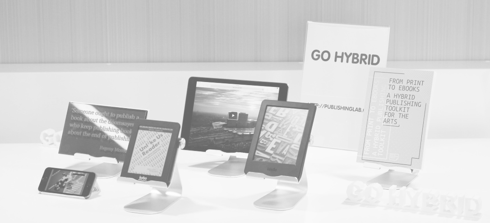

## Lab: How To
This section is about how to conduct yourself in the lab, how to work in a team, and how to best present your work.

### Multidisciplinary And Multicultural Team Work
At the PublishingLab you will work in a team of people with different skill sets and from different educational and cultural backgrounds. These differences can have an impact on how a team works together. Working in a team with a varied composition therefore requires a special attitude, both professionally and socially. Here are some things you should take into account.

### Language
Multidisciplinary and multicultural teams are great for creative processes. However, when people who work together have different languages, this can be an obstacle to success. Speaking in your mother tongue is very different from speaking in a second or third language. So please consider your words carefully; issues of differing interpretations may arise, as well as cultural differences, especially when the English is not the first language of either of you. Be proactive to overcome these differences: use visuals, write down your ideas, sketch. Make sure you understand each other.

### Styles of Communication
Methods of communication that are normal for one group of people may appear ineffective or inappropriate to another group. A person from a culture in which loud voices and interruptions are not seen as aggressive may intimidate someone from a culture that teaches more reserved modes of expression. Learning about the cultures of your team members before you start working with them can help you understand their methods of communication.

### In Case Of Conflict
When conflict does occur within a team, members from different backgrounds may react to the situation in dramatically different ways. Some people will repress their reactions to an insult, while others will fight back. These reactions are based on individual personality to some extent but are also conditioned by a person’s background. Resolving conflict requires:

* listening to the other person/people calmly
* an understanding of everyone’s view of what caused the conflict
* being open and respectful to each other’s background

You can ask your coach to mediate if you feel your attempts at solving the conflict are not working.

### Presenting Your Work
At the end of the design process you will have the opportunity to share what you created with the world. We use our website as a communication portal for all our projects, but you will also present your results to the creative industries during a final event.

### Blog
One of the PublishingLab’s most important communication channels is its blog. Here, project teams keep followers and friends updated on the latest developments and insights in their projects or in related fields. As a team we trust you are just as proud of your work as we are, and just as keen to share its news on a regular basis. In the first week you will learn how our blog works and how you can best communicate and promote your team’s work there. You will be expected to write a blog post at least twice a month during your internship.

### Sharing, Working and Documentation
To work together efficiently you’ll need tools to collaborate on projects, share documents and calendars, and communicate. There are huge numbers of digital tools available to help you with this: use them! The right tools will put the most relevant information within easy reach. See the tools section on our website for inspiration.

## Resources
These links, videos, books and tools will help prepare you for your role at the PublishingLab. Start by getting familiar with the Hybrid Publishing Toolkit.

Required Reading

### Hybrid Publishing Toolkit
We use the Hybrid Publishing Toolkit (and variations on it) to produce EPUBs, websites and printed publications. If you haven’t already read it, be sure to read it while you’re here. It explains the Hybrid Publishing Workflow, and the context of our work in the PublishingLab.

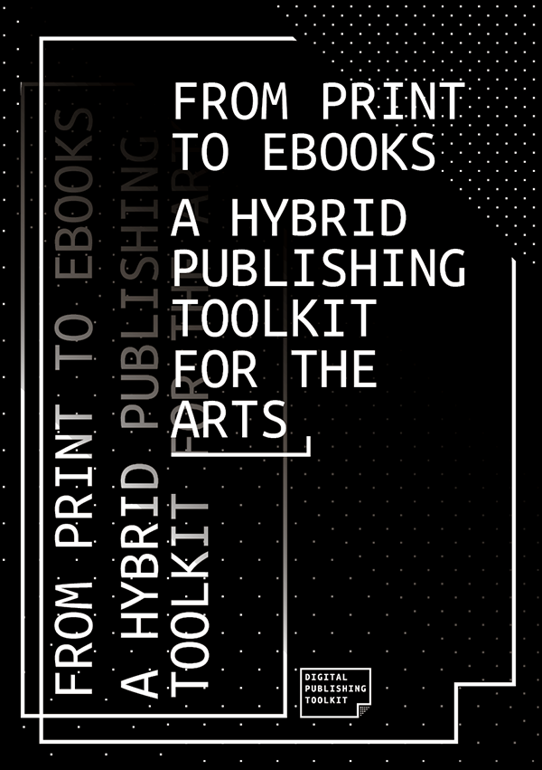

This Toolkit is meant for everyone working in art and design publishing. No specific expertise of digital or traditional publishing technology is required. The Toolkit provides hands-on practical advice and tools, focusing on working solutions for low-budget, small-edition publishing. Everything in the Hybrid Publishing Toolkit is based on real-world projects with art and design publishers. Editorial scenarios include art and design catalogues and periodicals, research publications, and artists’/designer’s books.

Download *From Print to Ebooks* [here](http://www.publishinglab.nl/blog/publication/from-print-to-ebooks-a-hybrid-publishing-toolkit-for-the-arts/).

### How To
Over the last two years we have improved our workflow. In our *[PublishingLab: How-to](http://publishinglab.nl/howto/?How-toHybridPublishing)* one can read the easy, step-by-step introductions to a specific field within digital publishing.
This how-to shows you how to create an epub using the Hybrid Publishing Workflow for creating multiple publications from one source file (including eBooks as ePub3 files).
You will find instructions and a template for making an ePub3, use CSS styles to modify your layout, and learn about the pros & cons of a fixed layout ePub. Additionally, some other current options for digital publishing are discussed.

### Sausage Machine
The <a href="http://hpt.publishinglab.org/">Sausage Machine</a> is an experimental system meant to facilitate hybrid text production. It builds upon the Hybrid Publishing Toolkit – an effort by a number of researchers and practitioners engaged in various forms of contemporary cross-media publishing. The Sausage Machine has been designed and programmed by Gottfried Haider during his employment at PublishingLab.

Optional Reading

* [Digital Publishing Toolkit: the Blogposts](http://www.publishinglab.nl/blog/publication/digital-publishing-toolkit-the-blog-posts/)
* [Network Cultures digital publishing blog](http://networkcultures.org/digitalpublishing/)
* [Out of Ink](http://networkcultures.org/outofink/)
* [Radical Tactics of the Offline Library by Henry Warwick](http://networkcultures.org/blog/publication/no-07-radical-tactics-of-the-offline-library-henry-warwick/)

### UX Principles
Everything has a user experience (UX). The goal of a UX designer is to make effective design for users, which is central to our work. UX research starts with the aim of understanding the user and the client goals, developing ideas to solve the users’ needs, and then building and testing the solutions created in the real world (or lab environment).

Required Reading

- [iOS Human Interface Guidelines](https://developer.apple.com/library/ios/documentation/UserExperience/Conceptual/MobileHIG/)
- Why you’re overthinking your UI/UX [video](https://developer.apple.com/library/ios/documentation/UserExperience/Conceptual/MobileHIG/)
- Google Specs for User Interaction [guidelines](https://www.google.com/design/spec/motion/material-motion.html#)

Optional Reading

- How to become a UX designer [video](https://www.youtube.com/watch?v=CexVeagtk2Y&feature=youtu.be)
- Paper prototyping [article](http://www.userfocus.co.uk/articles/paperprototyping.html)
- [Adaptive (ebook) Layout site](http://sorotokin.com/adaptive-layout/)
- [NN UX design reference](https://www.nngroup.com)

### Code
We don’t expect you to become a programmer if you are a designer, but coding is an essential design tool. Therefore, you need to have a basic but solid understanding of HTML and CSS at least. Knowing JS is not required by us, but it is definitely a plus.

Required Reading

- [Designing with code](https://stuffandnonsense.co.uk/blog/about/time_to_stop_showing_clients_static_design_visuals)
- [HTML & CSS crash course](https://www.codecademy.com/learn/web)
- [HTML glossary](https://www.codecademy.com/articles/glossary-html)
- [CSS glossary](https://www.codecademy.com/articles/glossary-css)
- [CSS Transitions vs Animations I](https://cssanimation.rocks/transition-vs-animation/)
- [CSS Flexbox](https://css-tricks.com/snippets/css/a-guide-to-flexbox/)
- [CSS Positioning - Absolute / Relative /  Static](https://css-tricks.com/absolute-positioning-inside-relative-positioning/)
- [Grids for the web I](http://www.slideshare.net/huer1278ft/grids-are-good-right)
- [Grids for the web II](https://www.smashingmagazine.com/2010/04/grid-based-web-design-simplified/)

Optional Reading

- [CSS Transitions vs Animations II](https://www.kirupa.com/html5/css3_animations_vs_transitions.htm)
- [CSS Transitions vs Animations III](http://css3.bradshawenterprises.com/transitions/)
- [CSS Positioning - Floats](https://css-tricks.com/all-about-floats/)
- [Styling and Animating SVG with CSS](https://www.smashingmagazine.com/2014/11/styling-and-animating-svgs-with-css/)
- [Getting Started with Javascript](https://developer.mozilla.org/en-US/Learn/Getting_started_with_the_web/JavaScript_basics)

#### Useful Resources
<!--it would be nice to have a list here next to the resources of recommended resources-->
* [Post-Digital Publishing Archive](http://p-dpa.net/) by Silvio Lorusso
* [James Bridle's](http://www.theguardian.com/profile/jamesbridle) articles on digital publishing at the Guardian
* [Mag.net reader](http://postdigitalprint.org/)

## Practical Info

Answers to your questions and steps to help you set yourself up for your internship.

#### HvA ID + Card
You will need a HvA ID card which functions as an office key, print and coffee machine card and ID card to borrow equipment. To get this card, you will be sent a HvA ID and password at your personal email as soon as your documents are received and processed. The HvA ID consists of the first few letters of your last name and the first letter of your first name, e.g.: John Doe becomes doej. You need this ID to get your card and thus to set everything else up, so keep an eye out for this email. Once you have your ID, follow these steps to get your card:

* Go to [mijnhvapas.nl](http://mijnhvapas.nl)
* Upload your picture (make sure to choose an *employee* card)
* After a few days you will receive a mail on your HvA mail, which is accessible through webmail.hva.nl (sign in with HvA ID and password). The email tells you that your card is ready (pick up point might be in another building).
* After you have picked up your card, you need to activate it (at the service point on level 2, Benno Premsela Huis) to get access to printer and the office.

If there is a problem or delay, you can check with staff on level 2 of the Benno Premselahuis (BPH).

#### How to print
You need your ID card to print. Set up the printer to your laptop by following instructions on the HvA [site](https://hva-en.cbs.canon.nl/wat_doen_wij/over-het-nieuwe-printen/medewerker.html).

##### Here is your quick start

1. First log in on [overhetnieuweprinten.nl](https://hva.mijnnieuweprinten.nl/Login/Login) with your HvA ID and password. By doing this, your account is set-up on the printers. This may take up to 15 minutes.
2. To ensure that you have the right settings on your computer, go to [overhetnieuweprinten.nl](https://hva.mijnnieuweprinten.nl/Login/Login) an hit the the tab ‘PRINT’ > ‘Drivers and Instructions’
3. Register your HvA-card on the printer once. You can do this as follows: put your HvA-card on the cardreader of the printer until you hear a ‘beep’
4. Enter your HvA-ID without @hva.nl (for example doej) and your password on the touchscreen of the printer. *(The touchscreen appears when you press the white input field)*
5. You are now ready to print!

#### Facilities
The PublishingLab office is located within the Hogeschool van Amsterdam Location: Benno Premselahuis (BPH), Rhijnspoorplein 1, 1091 GC Amsterdam

##### Opening hours of the BPH
Monday - Thursday: 7:30-19:30 
Friday: 7.30 – 18:00

##### Equipment hire and helpdesk
2nd Floor, Benno Premsela Huis

#### Internet access
You can access the internet via eduroam if you are already a student. Otherwise, ask your coach to set up a guest account. Once you have your HvA ID & password you can login to the eduroam or HvA wifi.

#### Claiming expenses
Read your contract and discuss with your manager to see if you are able to be reimbursed for travel costs. You need to have agreed on the possibilities of reimbursement with the project coach or manager before you make a purchase. You need the project number and to fill in a Declaration form/ Declaratie- en Voorschotformulier .xlsx document. Print the form with the original receipt attached (photocopies are not accepted) and put it on your manager’s desk to sign off. You will usually be reimbursed within the month, make sure your declaration is with the service desk by the 15th of the month. Be aware: it takes a few days by internal mail to reach the accounts desk. Call 020 595 2700 for declaration queries – if you tell them your employee number, they can track your payment.

#### Illness
In the event of illness, please contact your coach before 9:30am by email or sms.

#### Holidays
You can request a day off with your coach. Of course you will have to inform your team too. One-day requests: a week in advance. More than one day? At least 3 weeks in advance. Be aware that your requests may or may not be granted, depending on project needs. If you work 4 days a week, you get 4 days holiday total + the official HvA holidays (recess marked on HvA calendar in May, Summer & over Christmas).

#### Work Hours
Every team works from 9:00 until 17:30 (unless otherwise agreed with the coach).

#### Amsterdam Addresses
Welcome to Amsterdam! If you’re new, the previous interns found the following places & stores useful.
For more general guide to Amsterdam, see Rose Leighton’s *Student Guide to Amsterdam, by Hva Students for Students*, there will be a print copy in the office.

##### Paper Store
Vlieger, paper & art supply store
Amstel 34, 1017 AB
Amsterdam ph: 020 623 5834

##### Materials
For acrylic and workshop materials: [http://kunststofshop.nl](http://kunststofshop.nl)

##### Bookshops
[Athenaeum](https://www.athenaeum.nl/winkels/roeterseiland/), location Roeterseiland - Roetersstraat 41, Amsterdam  

San Serriffe – Art book shop (with good talks/book launches) Sint Annenstraat 30, Amsterdam.

## Schedule

 
Aug <strong>31</strong>, Wednesday

 
Sprint 0 - Kickoff

 
Sept <strong>1</strong>, Thursday

 
Zinestorming

 
Sept <strong>2</strong>, Friday

 
Sept <strong>3</strong>, Saturday

 
Sept <strong>4</strong>, Sunday

 
Sept <strong>5</strong>, Monday

 
Sprint 1 - Ideation and Planning

 
Sept <strong>6</strong>, Tuesday

 
Sept <strong>7</strong>, Wednesday

 
Sprint 1 - Translate

 
Sept <strong>8</strong>, Thursday

 
Partner Visit

 
Sept <strong>9</strong>, Friday

 
SCRUM Workshop

 
Sept <strong>10</strong>, Saturday

 
Sept <strong>11</strong>, Sunday

 
Sept <strong>12</strong>, Monday

 
Design Sprint

 
Sept <strong>13</strong>, Tuesday

 
Design Sprint

 
Sept <strong>14</strong>, Wednesday

 
Workshop - Define Intensions  / Charlie Mulholland / 09.30 - 12.30

 
Sept <strong>15</strong>, Thursday

 
Sept <strong>16</strong>, Friday

 
Deadline Design Brief

 
Sept <strong>17</strong>, Saturday

 
Sept <strong>18</strong>, Sunday

 
Sept <strong>19</strong>, Monday

 
Sept <strong>20</strong>, Tuesday

 
Peerpitch

 
Sept <strong>21</strong>, Wednesday

 
Sept <strong>22</strong>, Thursday

 
Sprint 1 - Review + Retrospective

 
Sept <strong>23</strong>, Friday

 
Sept <strong>24</strong>, Saturday

 
Sept <strong>25</strong>, Sunday

 
Sept <strong>26</strong>, Monday

 
Sprint 2 - Planning + Ideation

 
Sept <strong>27</strong>, Tuesday

 
Workshop with Geert Lovink

 
Sept <strong>28</strong>, Wednesday

 
Pitch training / Peter van Meersbergen / 13.30 - 17.30

 
Sept <strong>29</strong>, Thursday

 
Sept <strong>30</strong>, Friday

 
Oct <strong>1</strong>, Saturday

 
Oct <strong>2</strong>, Sunday

 
Oct <strong>3</strong>, Monday

 
Oct <strong>4</strong>, Tuesday

 
Oct <strong>5</strong>, Wednesday

 
Workshop - User & Context / Marco van Hout /  09.30 - 12.30

 
Oct <strong>6</strong>, Thursday

 
Sprint 2 - Translate

 
Oct <strong>7</strong>, Friday

 
Oct <strong>8</strong>, Saturday

 
Oct <strong>9</strong>, Sunday

 
Oct <strong>10</strong>, Monday

 
Oct <strong>11</strong>, Tuesday

 
Peerpitch

 
Oct <strong>12</strong>, Wednesday

 
Oct <strong>13</strong>, Thursday

 
Sprint 2 - Review + Retrospective

 
Oct <strong>14</strong>, Friday

 
Oct <strong>15</strong>, Saturday

 
Oct <strong>16</strong>, Sunday

 
Oct <strong>17</strong>, Monday

 
Coding Sprint

 
Oct <strong>18</strong>, Tuesday

 
Coding Sprint

 
Oct <strong>19</strong>, Wednesday

 
Coding Sprint

 
Oct <strong>20</strong>, Thursday

 
Coding Sprint

 
Oct <strong>21</strong>, Friday

 
Oct <strong>22</strong>, Saturday

 
Oct <strong>23</strong>, Sunday

 
Oct <strong>24</strong>, Monday

 
Sprint 3 - Ideation + Planning

 
Oct <strong>25</strong>, Tuesday

 
Oct <strong>26</strong>, Wednesday

 
Workshop Frame insights & Ideation / Charlie Mulholland / 09.30 - 12.30

 
Oct <strong>27</strong>, Thursday

 
Oct <strong>28</strong>, Friday

 
Oct <strong>29</strong>, Saturday

 
Oct <strong>30</strong>, Sunday

 
Oct <strong>31</strong>, Monday

 
Nov <strong>1</strong>, Tuesday

 
Nov <strong>2</strong>, Wednesday

 
Sprint 3 - Translate

 
Nov <strong>3</strong>, Thursday

 
Nov <strong>4</strong>, Friday

 
Nov <strong>5</strong>, Saturday

 
Nov <strong>6</strong>, Sunday

 
Nov <strong>7</strong>, Monday

 
Nov <strong>8</strong>, Tuesday

  
Peerpitch

 
Nov <strong>9</strong>, Wednesday

 
Nov <strong>10</strong>, Thursday

 
Nov <strong>11</strong>, Friday

 
Nov <strong>12</strong>, Saturday

 
Nov <strong>13</strong>, Sunday

 
Nov <strong>14</strong>, Monday

 
Sprint 4 - Ideation + Planning

 
Nov <strong>15</strong>, Tuesday

 
Nov <strong>16</strong>, Wednesday

 
Nov <strong>17</strong>, Thursday

 
Nov <strong>18</strong>, Friday

 
Nov <strong>19</strong>, Saturday

 
Nov <strong>20</strong>, Sunday

 
Nov <strong>21</strong>, Monday

 
Nov <strong>22</strong>, Tuesday

 
Nov <strong>23</strong>, Wednesday

 
Sprint 4 - Translate

 
Nov <strong>24</strong>, Thursday

 
Nov <strong>25</strong>, Friday

 
Nov <strong>26</strong>, Saturday

 
Nov <strong>27</strong>, Sunday

 
Nov <strong>28</strong>, Monday

 
Nov <strong>29</strong>, Tuesday

 
Peerpitch

 
Nov <strong>30</strong>, Wednesday

 
Dec <strong>1</strong>, Thursday

 
Sprint 4 - Review + Retrospective

 
Dec <strong>2</strong>, Friday

 
Dec <strong>3</strong>, Saturday

 
Dec <strong>4</strong>, Sunday

 
Dec <strong>5</strong>, Monday

 
Sprint 5 - Ideation + Planning

 
Dec <strong>6</strong>, Tuesday

 
Dec <strong>7</strong>, Wednesday

 
Dec <strong>8</strong>, Thursday

 
Dec <strong>9</strong>, Friday

 
Dec <strong>10</strong>, Saturday

 
Dec <strong>11</strong>, Sunday

 
Dec <strong>12</strong>, Monday

 
Dec <strong>13</strong>, Tuesday

 
Dec <strong>14</strong>, Wednesday

 
Sprint 5 - Translate

 
Dec <strong>15</strong>, Thursday

 
Dec <strong>16</strong>, Friday

 
Dec <strong>17</strong>, Saturday

 
Dec <strong>18</strong>, Sunday

 
Dec <strong>19</strong>, Monday

 
Dec <strong>20</strong>, Tuesday

 
Peerpitch

 
Dec <strong>21</strong>, Wednesday

 
Dec <strong>22</strong>, Thursday

 
Sprint 5 - Review + Restrospective

 
Dec <strong>23</strong>, Friday

 
Dec <strong>24</strong>, Saturday

 
Dec <strong>25</strong>, Sunday

 
Dec <strong>26</strong>, Monday

 
Christmas Break

 
Dec <strong>27</strong>, Tuesday

 
Christmas Break

 
Dec <strong>28</strong>, Wednesday

 
Christmas Break

 
Dec <strong>29</strong>, Thursday

 
Christmas Break

 
Dec <strong>30</strong>, Friday

 
Christmas Break

 
Dec <strong>31</strong>, Saturday

 
Christmas Break

 
Jan <strong>1</strong>, Sunday

 
Christmas Break

 
Jan <strong>2</strong>, Monday

 
Christmas Break

 
Jan <strong>3</strong>, Tuesday

 
Christmas Break

 
Jan <strong>4</strong>, Wednesday

 
Christmas Break

 
Jan <strong>5</strong>, Thursday

 
Christmas Break

 
Jan <strong>6</strong>, Friday

 
Jan <strong>7</strong>, Saturday

 
Jan <strong>8</strong>, Sunday

 
Jan <strong>9</strong>, Monday

 
Sprint 6 - Ideation + Planning

 
Jan <strong>10</strong>, Tuesday

 
Jan <strong>11</strong>, Wednesday

 
Sprint 6 - Translate

 
Jan <strong>12</strong>, Thursday

 
Jan <strong>13</strong>, Friday

 
Dec <strong>14</strong>, Saturday

 
Jan <strong>15</strong>, Sunday

 
Jan <strong>16</strong>, Monday

 
Sprint 6 - Review

 
Jan <strong>17</strong>, Tuesday

  
Try Out

 
Jan <strong>18</strong>, Wednesday

 
Final Presentation

 
Jan <strong>19</strong>, Thursday

 
LAST DAY - Deliver Package to Partners

 
Jan <strong>20</strong>, Friday

 
Dec <strong>21</strong>, Saturday

 
Jan <strong>22</strong>, Sunday

 
Jan <strong>23</strong>, Monday

 
Jan <strong>24</strong>, Tuesday

 
Jan <strong>25</strong>, Wednesday

 
Jan <strong>26</strong>, Thursday

 
Jan <strong>27</strong>, Friday

 
Dec <strong>28</strong>, Saturday

 
Jan <strong>29</strong>, Sunday

 
Jan <strong>30</strong>, Monday

 
Jan <strong>31</strong>, Tuesday

 

### Deliverables And Wrap Up Checklist

 

1. Please deliver a .zip file to your coach including all of the following documents (if applicable to your project):
	- Research poster (final_research_poster.pdf) - if available
	- Project posters.
	- All presentations in .pdf format.
	- Final Video - if available
	- Possible pictures documenting the process.
	- Test/survey data in test_data.xls - if available
	- Final budget - if available
	- List of all contacts.
	- 3D Models - if available
	- Final design and styleguide.
	- Wireframes - In case of hardware: schematic of the circuit(s), and provide a list of components.
2. Please upload to PublishingLab's Social Media (ask your PM for login details for the different accounts):
	- Upload final poster to ISSUU, But ONLY if it will NOT be sent in for publication to conferences or journals.
	- Please clean up your dropbox/drive and order it. Delete all draft files and just keep the final versions of the files.
	- Please put all documented/commented code on Github.
	- If applicable, put your whole project on the Virtual Machine server of the HvA (keep in mind that it runs ubuntu).
	- Please upload your final video to PublishingLab's Vimeo account, add meaningful tags and include the school year & semester.
	- Please upload relevant pictures (30-40 pics) from all phases of the project to Flickr and use proper tags (check how previous projects are tagged). Make a set for your project and add the pics to the set.
	- Please update your project page on the PublishingLab website.
	- Please wrap up your project blog with a final post.

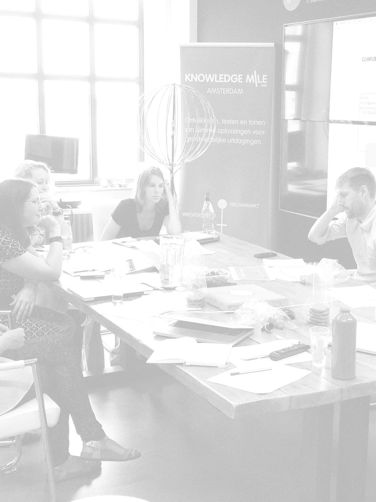

[^SCRUM] http://www.scrumguides.org/scrum-guide.html