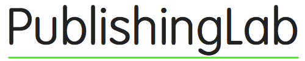
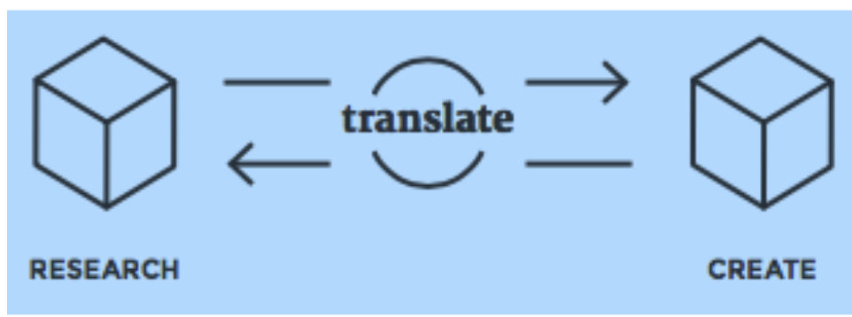
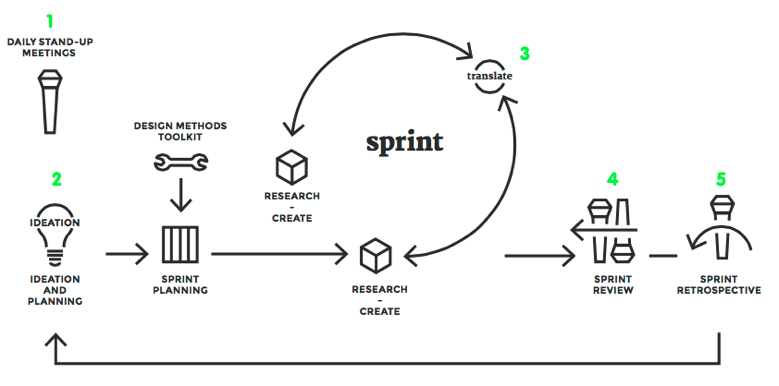
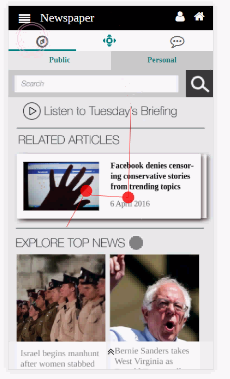
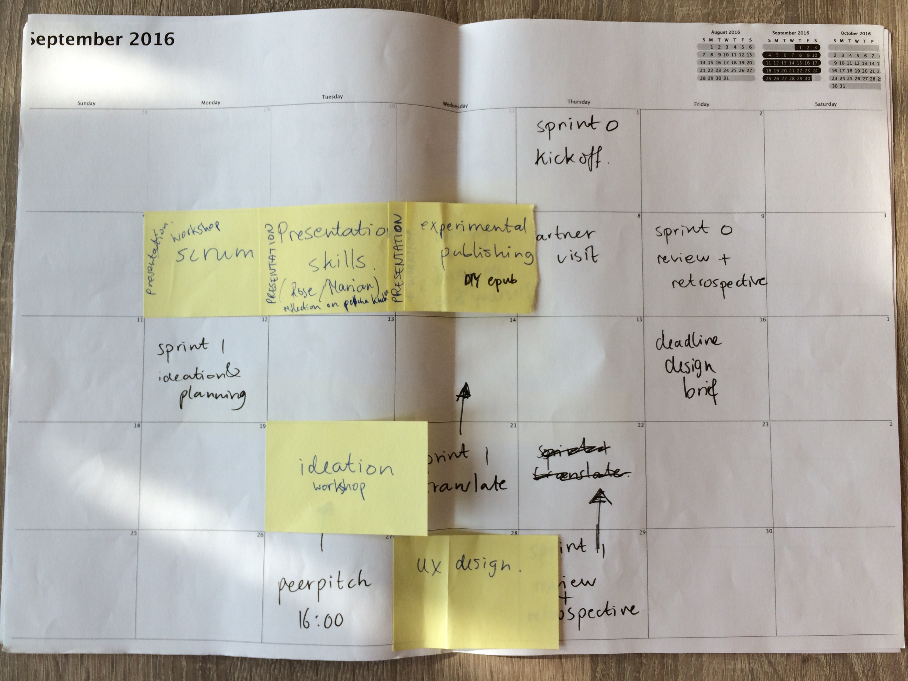
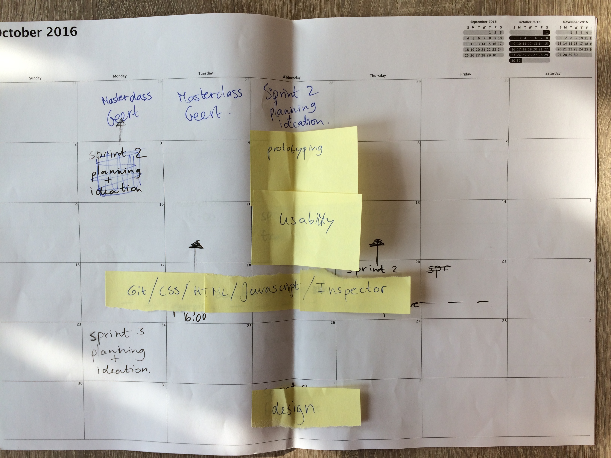
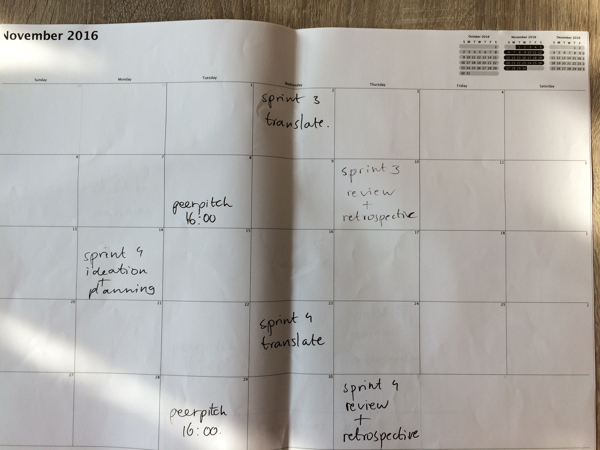
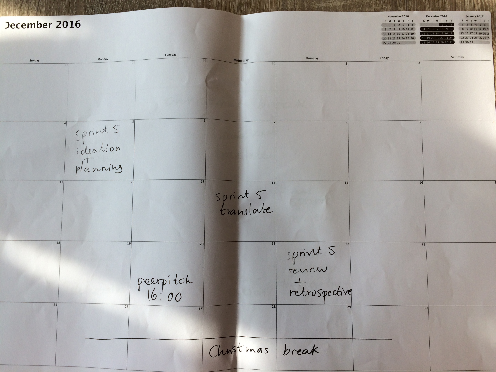
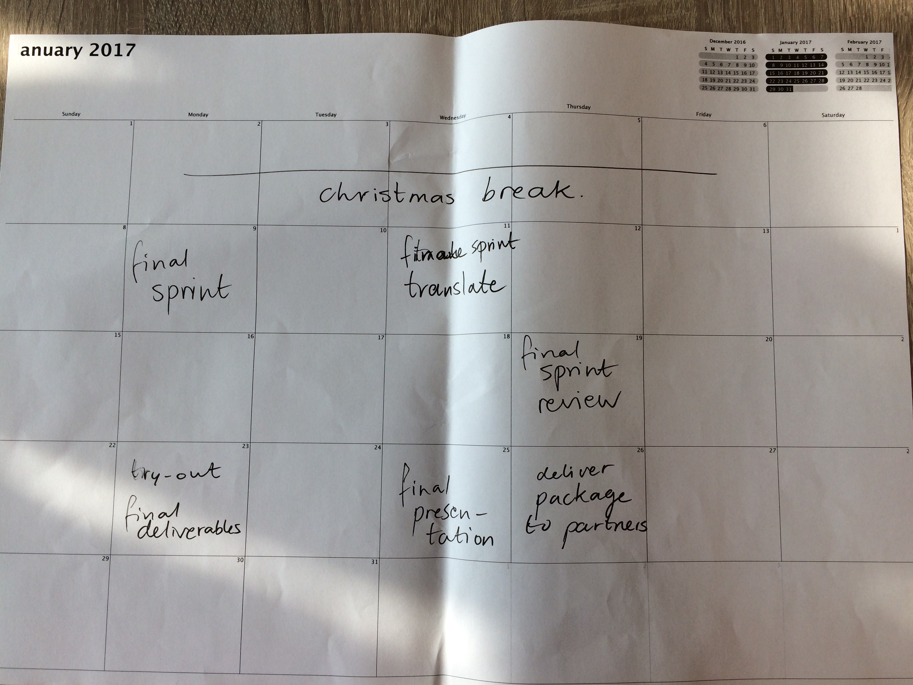

## Colophon

### PublishingLab manual, semster 2016-2017 
**Editors:** to be defined 
**Images:** to be defined 
**Print design:** to be defined 
**EPUB design:** to be defined 
**Cover design:** to be defined 
**Publisher:** PublishingLab, Amsterdam 
**Supported by:** Amsterdam Creative Industries Network

**An EPUB and PDF edition of this publication are freely downloadable from:** [http://publishing.org/publications/](http://publishinglab.org/publications/)

**Contact:** 
PublishingLab 
Amsterdam University of Applied Sciences 
Rhijnspoorplein 1 
1091 GC Amsterdam 
Room: 04A07 
The Netherlands 
[http://publishinglab.org](http://www.publishinglab.org) 

This publication is licensed under Creative Commons Attribution NonCommercial ShareAlike 4.0 Unported (CC BY-NC-SA 4.0). To view a copy of this license, visit [http://creativecommons.org/licenses/by-nc-sa/4.0/](http://creativecommons.org/licenses/by-nc-sa/4.0/).

Amsterdam, 2016 

<!--A cover needs to be added -->

# PUBLISHINGLAB MANUAL 2016-2017

#### Table of Contents

- [About](#about)
- [Who We Are](#whoarewe)
- [Who Our Interns Are](#whoareinternsare)
- [WHO Our Partners Are](#whoourpartnersare)
- [What We Do](#whatwedo)

- [Lab](#lab)
- [Multidisciplinary And Multicultural Teamwork](#teamwork)
- [LANGUAGE](#language)
- [COMMUNICATION STYLES](#communication)
- [HIERARCHY](#hierarchy)
- [Conflict](#conflict)
- [Presenting Your Work](#presenting)
- [Blog](#blog)
- [Sharing, Working And Documentation](#documentation)

- [Process](#process)
- [Design Process](#designproces)
- [Research, Translate And Create](#researchtranslatecreate)
- [SCRUM](#scrum)
- [Sprints](#sprints)
- [Rituals](#rituals)

- [Workshops](#workshops)
- [SCRUM](#scrum)
- [Presentaiton Skills](#presentation)
- [DIY Publishing](#publishing)
- [Ideation](#ideation)
- [Writing](#writing)
- [UX Design](#UX)
- [PROTOTYPING](#prototyping)
- [GIT](#git)
<!--- [CSS](#CSS)-->
- [HTML](#HTML)
- [JavaScript](#javascript)
- [Inspector](#inspector)
- [Design](#design)

- [Resources](#resources)
- [Hybrid Publishing Workflow](#HPW)
- [UX Principles](#UX)
- [Code](#code)
- [Interesting Reads](#reads)

- [Practical Info](#practicalinfo)
- [PProgramme](#programme)

------

##ABOUT
Welcome to [PublishingLab](http://publishinglab.org), this section tells you a bit about who we are, who our interns are and who our partners are. You will also find an overview of what we do.

###WHO ARE WE
The PublishingLab is an applied research lab in the field of hybrid publishing working at the intersection of publishing and digital technology, both in print and digitally. We are part of the Amsterdam Creative Industries Network (ACIN), Create-IT research center and the Amsterdam University of Applied Sciences. The world of digital publishing has been growing steadily for several years. The arrival of tablets and smartphones has accelerated these developments, and today it is impossible to imagine a media landscape without e-books, newspaper apps, and digital magazines. Digitalization is turning the field upside down! This is where the PublishingLab comes in.

The PublishingLab is part of [ACIN](http://www.amsterdamcreativeindustries.com), the national talent, knowledge and business network for creative industry and digital technology. ACIN was founded by the Amsterdam University of Applied Sciences, the Amsterdam School of the Arts and Inholland University of Applied Sciences. ACIN currently hosts 11 other labs such as Art&Technology lab, Fashion&Technology lab, Gamelab, etc. PublishingLab is based in Benno Premselahuis, at the School of Design & Communication from the Amsterdam University of Applied Sciences. Students, teachers and researchers work together on applied research with the creative industries and the ICT sector. The results will be used in curriculum development and for consulting the industry. Together with the [Institute of Network Cultures](http://networkcultures.org) (INC), PublishingLab is located on the Amstel Campus Amsterdam.

###WHO OUR INTERNS ARE
PublishingLab works with students from different backgrounds, offering a wide range of opportunities to its students – from experimenting with digital publishing work flows to testing user interface design. We like to work with students who don’t give up easily; who like experimenting with text, typography, code, (moving) images and the opportunities that digital media provide. We work with students with design, hacking, writing and many other skills; the teams are multidisciplinary and selected to fit the needs of the project. We’re looking for motivated people who respond to opportunities and challenges intelligently, creatively and want to push the boundaries of hybrid publishing.

###WHO OUR PARTNERS ARE
PublishingLab works with various partners, ranging from government institutions, Dutch SMEs, and large international corporations in the field of digital media and publishing. Our projects are always shaped in co-creation with our partners. Working with partners means the PublishingLab has a good network in Amsterdams creative industries. Recent partners include Persgroep Nederland, Persgroep Digitaal, WeekbladpersGroep, UNStudio, Canon, Cinekid, Hogeschool Bibliotheek Amsterdam, Het Vlaams-Nederlands platform Laboratorium Actuele Kunstkritiek, Domein voor Kunstkritiek, rekto:verso, Archined, Piet Zwart Institute and many others.

<!--maybe add some queotes from partners-->

###WHAT WE DO
<!--underneath section needs to be rephrased -->
At the PublishingLab, our research is directed towards the following three groups:

1. makers (authors, designers);
2. intermediaries (publishers);
3. end users (readers / students).
The PublishingLab conducts applied research by doing innovative experiments in the field of (digital) publishing. This includes research on the impact of developments on the branch as a whole, conducting small experiments in the field of EPUB3 (such as research/work on user interface design for collaborative online editing environments), research/work on conveying hybrid publishing concepts and work flows to a non-expert audience or experiments with the aim of solving interesting design problems.

##LAB: HOW TO
This section is about how to conduct yourself in the lab, how to work in a team, and how to best present your work.

###MULTIDISCIPLINARY AND MULTICULTURAL TEAM WORK
At the PublishingLab you will work in a team of people with different skill sets and from different educational and cultural backgrounds. These differences can have an impact on how a team works together. Working in a team with a varied composition therefore requires a special attitude, both professionally and socially. Here are some things you should take into account.

###LANGUAGE
Multidisciplinary and multicultural teams are great for creative processes. However, when people who work together have different languages, this can be an obstacle to success. Speaking in your mother tongue is very different from speaking in a second or third language. So please consider your words carefully; issues of differing interpretations may arrise, as well as cultural differences, especially when the English is not the first language of either of you. Be proactive to overcome these differences: use visuals, write down your ideas, sketch. Make sure you understand each other.
###STYLES OF COMMUNICATION
Methods of communication that are normal for one group of people may appear ineffective or inappropriate to another group. A person from a culture in which loud voices and interruptions are not seen as aggressive may intimidate someone from a culture that teaches more reserved modes of expression. Learning about the cultures of your team members before you start working with them can help you understand their methods of communication.

###HIERARCHY
The importance placed in figures of authority varies greatly between cultures. Some groups give great respect to people in positions of authority, while people from other cultures are perfectly willing to question an authority figure if they see them doing something wrong. Additionally, authority is based on different criteria in different cultures.

###IN CASE OF CONFLICT
When conflict does occur within a team, members from different backgrounds may react to the situation in dramatically different ways. Some people will repress their reactions to an insult, while others will fight back. These reactions are based on individual personality to some extent but are also conditioned by a person’s background. Resolving conflict requires:
* listening to the other person/people calmly
* an understanding of everyone’s view of what caused the conflict
* being open and respectful to each other’s background

You can ask your coach to mediate if you feel your attempts at solving the conflict are not working.
###PRESENTING YOUR WORK
At the end of the design process you will have the opportunity to share what you created with the world. We use our website as a communication portal for all our projects, but you will also present your results to the creative industries during a final event.

###BLOG
One of the PublishingLab’s most important communication channels is its blog. Here, project teams keep followers and friends updated on the latest developments and insights in their projects or in related fields. As a team we trust you are just as proud of your work as we are, and just as keen to share its news on a regular basis. In the first week you will learn how our blog works and how you can best communicate and promote your team’s work there. You will be expected to write a blog post at least twice a month during your internship.

###SHARING, WORKING AND DOCUMENTATION
To work together efficiently you’ll need tools to collaborate on projects, share documents and calendars, and communicate. There are huge numbers of digital tools available to help you with this: use them! The right tools will put the most relevant information within easy reach. See the tools section on our website for inspiration.

##PROCESS
This section explains how we work: the process and design methods for completing your project.

One of the methods we use, is the MediaLAB Amsterdam design process <!--insert link to design process-->, which is a problem-solving method that helps create and evaluate solutions in response to challenges. In this process one tries to evoke real curiosity in order to make teams feel highly motivated to  nd answers and solutions. This involves lots of iterations, making, prototyping, going out on field studies and testing each idea, concept or prototype with actual users.

<<<<<<< Updated upstream
##PROCESS
This section explains how we work: the process and design methods for completing your project.

One of the methods we use, is the [MediaLAB Amsterdam](http://medialabamsterdam.com/) design process, which is a problem-solving method that helps create and evaluate solutions in response to challenges. In this process one tries to evoke real curiosity in order to make teams feel highly motivated to find answers and solutions. This involves lots of iterations, making, prototyping, going out on field studies and testing each idea, concept or prototype with actual users.

Figure 1. MediaLAB Amsterdam Design Process, Research, Translate and Create phase (source: Manual MediaLAB Design Process 2014).

###RESEARCH, TRANSLATE AND CREATE
At the start of each new stage in the design process, research has a central role. Research provides plenty of insights, for example about how people act/think/feel and who the intended users are. These insights are the key to finding a solution, but first they have to be translated into actual design decisions. Making a prototype based on these decisions will help you test their effectiveness. A next step might be to go back to the research to find other solutions, or to set up a test with users. During the project there is a constant two-way flow: from research through translation to creation, and from creation through translation to research.

###SCRUM
Scrum is an iterative and incremental process for the design and development of products and services, and it has a very specific way of organizing a team. Tasks are achieved faster and with higher quality when using the Scrum Framework. This is possible because of the high self-motivation of the team, which chooses its own tasks and how to execute them. The project partner’s demands are iteratively prioritized and quickly actualized. The flow of the design process is embedded in a sprint-based schedule, ideally supported by Scrum roles, rituals, sessions and artifacts that support the process.

###SPRINTS
A ‘sprint’ (or iteration) is the basic unit of development. The sprint is a ‘timeboxed’ effort: it is restricted to a specific duration. The sprints in the PublishingLab have an average duration of three weeks. However, teams are free to perform more sprints within those scheduled three weeks.

###RITUALS
Specific ‘rituals’ guide the development of a sprint. Each sprint starts with an ideation and planning session, has a mid-sprint translation / transfer session, and ends with a sprint review meeting and retrospective. During a sprint, the team has daily stand-up meetings.

=======

<!--image of bad quality, but gives an idea of what is desired. change icons.-->

Figure 1. MediaLAB Amsterdam Design Process, Research, Translate and Create phase (source Manual MediaLAB Design Process 2014).

###RESEARCH, TRANSLATE AND CREATE
At the start of every design challenge, and afterwards, at the start of each new stage in the design process, research has a central role. Research provides plenty of insights; how people act/think/feel and who the intended users are, within the context of the challenge.
These insights are the key to a solution, but they have to be translated into actual design requirements: which are key for the optimal solution. This is something that can be decided on the basis of research, and implemented and tested by creating a prototype. A next step might be to research again into what you created by setting up a test with users. During the project there is a constant two-way flow: from research through translation to creation, and from creation through translation to research.

###SCRUM
Scrum is an iterative and incremental process for the design and development of products and services, and it has a very specific way of organizing a team. Tasks are achieved faster and with higher quality when using the Scrum Framework.
This is possible because of the high self-motivation of the team, which chooses its own tasks and how to execute them. The project partner’s demands are iteratively prioritized and quickly actualized. The flow of the design process is embedded in a sprint-based schedule, ideally supported by Scrum roles, rituals, sessions and artifacts that support the process.

###SPRINTS
A ‘sprint’ (or iteration) is the basic unit of development. The sprint is a ‘timeboxed’ effort; that is, it is restricted to a specific duration. The sprints in the PublishingLab have an average duration of three weeks. However, teams are free to perform more sprints within those scheduled three weeks.

###RITUALS
Specific ‘rituals’ guide the development of a sprint. Each sprint starts with an ideation and planning session, has a mid-sprint translation / transfer session, and ends with a sprint review meeting and retrospective. During a sprint, the team has daily stand-up meetings.
>>>>>>> Stashed changes

<<<<<<< Updated upstream
Figure 2. MediaLAB Amsterdam Design Process (source: Manual MediaLAB Design Process 2014).

1. DAILY STAND-UP MEETINGS
The daily stand-up meeting takes place at the same time and place of every working day. The daily scrum meeting is held in the morning, as it helps set the goal for the coming day’s work. These scrum meetings are strictly time-boxed to 15 minutes. This keeps the discussion brisk and relevant.
The daily stand-up meeting is not used as a problem-solving or issue resolution meeting. Issues raised are usually dealt with immediately after the meeting. During the daily scrum, each team member answers the following three questions:
	1. What did you do yesterday?
	2. What will you do today?
	3. Are there any barriers in your way?

2. IDEATION AND PLANNING

Every sprint has a ‘ideation and planning’ session. In this session the creative process is triggered by the facilitation of a brainstorm and ideation session in which ideas are identified and quickly sketched. The most promising ideas are placed in a hierarchy and a decision is made which of these will be taken along in the sprint. After this, tasks are identified, but more importantly the exact sprint goal (and duration) is defined. It is important to have a very clear goal, so that the team can break the effort down into smaller pieces that contribute to achieving that goal more smoothly.
3. TRANSLATE AND TRANSFER

In the middle of the 3-week sprint there is a scheduled ‘translate and transfer’ session in which your team and the project-related researchers come together to translate research insights and decide which things to act on in this sprint or the next (transfer).

4. SPRINT REVIEW

After the team has completed the planned deliverables for this sprint it is time for the ‘sprint review’. In this meeting, which is organized with all stakeholders present, decisions on progress and how to proceed are made, including next steps and possible needs and wishes. Specifically, the team will present the work they did during the sprint and will run through the sprint backlog together with stakeholders.

5. SPRINT RETROSPECTIVE
A ‘sprint retrospective’ is held at the very end of each sprint. This is a meeting to reflect on both the results and the processes with the team. It is meant to change, improve, or stick to the way you work and function as a team.

=======

Figure 2. MediaLAB Amsterdam Design Process (source Manual MediaLAB Design Process 2014).

1. DAILY STAND-UP MEETINGS
The daily stand-up meeting takes place at the same time and place of every working day. The daily scrum meeting is held in the morning, as it helps set the context for the coming day’s work. These scrum meetings are strictly time-boxed to 15 minutes. This keeps the discussion brisk but relevant.
The daily stand-up meeting is not used as a problem-solving or issue resolution meeting. Issues raised are usually dealt with immediately after the meeting. During the daily scrum, each team member answers the following three questions:
	1. What did you do yesterday?
	2. What will you do today?
	3. Are there any barriers in your way?

2. IDEATION AND PLANNING

Every sprint has a ‘ideation and planning’ session. In this session the creative process is triggered by the facilitation of a brainstorm and ideation session in which ideas are identi ed and quickly sketched. The most promising ideas are placed in a hierarchy and it is decided which have potential to be taken along in the sprint. After this, tasks are identi ed, but more importantly the exact sprint goal (and duration) is defined. It is important to have a very clear goal, so that the team can break the e ort down into smaller-sized pieces that contribute to achieving that goal more smoothly,
3. TRANSLATE AND TRANSFER

In the middle of the 3-week sprint there is a scheduled ‘translate and transfer’ session in which your team and the project-related researchers come together to translate research insights and decide which things to act on in this sprint or the next (transfer).

4. SPRINT REVIEW

After the team has completed the planned deliverables for this sprint it is time for the ‘sprint review’. In this meeting, which is organized with all stakeholders present, decisions on progress and how to proceed are made, including next steps and possible needs and wishes. Specifically, the team will present the work they did during the sprint and will run through the sprint backlog together with stakeholders.

5. SPRINT RETROSPECTIVE
A ‘sprint retrospective’ or ‘peer pitch’ is held at the very end of each sprint. This is a meeting to re ect on both the results and the processes with the team. It is meant to change, improve, or stick to the way they work and function as a team.
>>>>>>> Stashed changes

<!--user stories-->
<!--method cards-->
<!--time estimation-->
<!--single tasks-->

##WORKSHOPS

###SCRUM
To structure the collaborative process of your project, we use the Scrum method. By setting clearly defined goals and dividing roles and tasks between team members, the method allows for an iterative approach to challenges and breaks larger goals up into achievable parts. During this workshop you will familiarize yourself with this way of working.

###PRESENTATION SKILLS
Working on a project for a client means that you have to present your research, findings, plans and advice to them in a professional manner. This workshop is designed to help you make well structured and convincing presentations.

###DIY PUBLISHING
<!-- @Silvio: this is your workshop, could you add a description? -->

###IDEATION
<!-- @Margreet: I don't know what to write for this one-->

###UX DESIGN
<!-- @Margreet: I don't know what to write for this one-->

###PROTOTYPING
How do you test your concepts without spending a lot of time programming only to discover something doesn't work the way you expected it to? From quick paper prototyping to increasingly high fidelity techniques, this workshop will teach you more about different methods of prototyping and when and why they are useful.

###GIT
Git is a source code management system that allows collaborative work and version control. It is an important component of the Hybrid Publishing Toolkit and widely used for developers in a multitude of projects. In this workshop we'll go through the basics of using Git by starting a collaborative project on GitHub. We'll use the command line and a graphical interface, so that you can experiment with both and choose your favorite.

###HTML & CSS
HTML and CSS are the foundation of design for the web. They are also core languages in epub development. While HTML is responsible for the structure of the document, CSS is in charge of how it looks. This workshop will review the basics of HTML5 and CSS3: from the anatomy of a HTML file and CSS selectors to CSS animations and transitions.

###JAVASCRIPT
Javascript, or simply JS, is responsible for the interaction in web pages. Understanding the DOM (Document Object Model), DOM events, variables, functions and how to use JS to add interaction to your pages is what this workshop is all about.

###INSPECTOR
The page inspector is a handy tool available in modern web browsers. It helps us examine HTML, CSS and JS and allows us to edit and debug our code - all in the browser and with instantly viewable results!

###DESIGN

##MASTERCLASS
During the semester Geert Lovink, founder of the [Institute of Network Cultures](http://networkcultures.org) will give a two-day masterclass. Geert will cover three topics: the first session is dedicated to internet criticism after 2008, the second to discussing two INC networks: [Unlike Us](http://networkcultures.org/unlikeus) about alternatives in social media, and [Society of the Query](http://networkcultures.org/query), on the politics and aesthetics of search.

<!-- @Margreet: what will happen on the second day?-->

##SHOWCASES

<<<<<<< Updated upstream
###Transforming Hit 'n' Run Millennials (2016)

<!--challenge / research question:-->
How can De Persgroep build sustainable relationships with millennial readers that arrive to their articles through social media links?

<!--short alinea what the project is about-->
De Persgroep notices that many visits to their sites can be characterized as 'hit 'n' run'; the reader clicks on a link in their Facebook timeline or Twitter feed, reads 1 article while hardly being aware of the site it is part of, and leaves without any promise of returning. They want to find innovative ways of taking this first moment of interaction between a new reader and their brand further and build a sustainable relationship.

<!--partner(s)-->
De Persgroep

<!--team-->
Ilayda Ṣarlak, Alina Niemann, Belen Muñoz, Inte Gloerich (coach) and Lucia Dossin (support).

<!--url-->
[Transforming Hit 'n' Run Millennials](http://www.publishinglab.nl/transforminghnrmillennials/)

<!--appealing image-->

<!--connect research paper-->
Millennials grew up in a world of free online news; news sites sold ads to companies and readers payed with their attention and clicks instead of their money. With the advent of adblockers and overall disappointing ad effectiveness, this exchange isn't as profitable as it once was imagined to be. News sites the world over are struggling to keep afloat and engaging a new generation of readers seems essential in acchieving this. If millennials won't commit to 1 medium and pay a substantive subscription fee, what are innovative ways for news sites to make their product profitable and sustainable?

###Navigating Theory on Demand (2015)

=======
###PERSGROEP
<!--title (year)-->
Navigating Theory on Demand (2015)

>>>>>>> Stashed changes
<!--challenge / research question:-->
How do we maximize efficiency and co-existence of the various formats (epub, print, HTML) for the INC 'Theory on Demand' series?

<!--short alinea what the project is about-->
The 'Theory on Demand' series is currently hosted on the INC website, which, unfortunately, is lacking a comprehensive searching tool or a filter to access the content of the publication. Although the current website has favourable aesthetics, it functions as a static and non-navigable platform. What can an ideal (and effective) academic publication look like in the digital realm?

<!--partner(s)-->
Institute of Network Cultures

<!--team-->
Léna Robin, Josip Batinic, Inte Gloerich (coach), Gottfried Haider and Lucia Dossin (support).

<!--url-->
[Navigation Theory on Demand](http://www.publishinglab.nl/navigating-tod/)

<!--appealing image-->

<!--connect research paper-->
The project task involved adapting the already existing print and static content of the INC’s ‘Theory on Demand’ series onto the digital screens, more precisely, creating a fully digital version of the book, making use of the advantages and the possibilities of the web-page format. It can be seen as existing in the context of other innovative online publications such as [Open!](http://www.onlineopen.org/index.php) and [Fold](http://www.onlineopen.org/index.php).

<<<<<<< Updated upstream
###Knowledge Matters - Interactive Book App (2015)

<!-- challenge / research question: -->
How can an interactive experience help a reader understand the architectural principles underpinning 25+ years of work and research in a way that print can’t?

<!-- editor , here's an alternative version -->

<!--How can we start a dialogue between print and digital media? And how can the values, methods and language of UNStudio be enhanced with an immersive digital experience?-->

<!-- short alinea what the project is about -->
The Knowledge Matters app is a digital extension of a printed book by UNStudio, presenting the Arnhem train station project as an interactive experience. It is divided in two ways of navigating through the content, based on time. The 'fast' mode is a selection of material presented as highlights of the project in linear narrative on a timeline. The 'slow mode' offers more detailed information on the project fitting the academic type of user who is searching for in-depth knowledge. Here, the non-linear menu allows the user to make intuitive choices and construct his or her own story.

<!-- partner(s) -->
UNStudio

<!-- team -->
Anastasia Kubrak, Karina Zavidova, Joana Chicau, Wahid Nawzadi, Jess van Zyl (coach), Gottfried Haider and Lucia Dossin (support).

<!-- url -->
[UNStudio](http://www.publishinglab.nl/unstudio/)

<!-- appealing image -->

=======
###UNSTUDIO
<!-- title (year) -->
Knowledge Matters - Interactive Book App (2015)

<!-- challenge / research question: -->
How can an interactive experience help a reader understand the architectural principles underpinning 25+ years of work and research in a way that print can’t?

<!-- editor , here's an alternative version -->

<!--How can we start a dialogue between print and digital media? And how can the values, methods and language of UNStudio be enhanced with an immersive digital experience?-->

<!-- short alinea what the project is about -->
Knowledge Matters app is a digital extension of a printed book by UNStudio, that represents the Arnhem Station project as an interactive experience. It is divided in two ways of navigating through the content, based on time.

The “fast” mode is a selection of material thought to be presented as highlights of the project. It is a linear narrative, presented within a chronological order, as a timeline. The “slow mode” offers more detailed information on the project which fits the “academic” type of user, who is searching for in-depth knowledge. A non-linear menu allows the user to make intuitive choices and construct his own story.

<!-- partner(s) -->
UNStudio

<!-- team -->
Anastasia Kubrak, Karina Zavidova, Joana Chicau, Wahid Nawzadi, Jess van Zyl (coach), Gottfried Haider and Lucia Dossin (support).

<!-- url -->
http://www.publishinglab.nl/unstudio/

<!-- appealing image -->

<!-- this image is HUGE (15MB). Use the following if filesize becomes an issue -->
<!--  -->

>>>>>>> Stashed changes
<!-- connect research paper -->
The goal of the interactive book ‘Knowledge Matters’ was to design an extension of a printed book: maybe a digital book? While analyzing and selecting material from the digital archive of The UNStudio and becoming aware of its potential, we understood that a new approach had to be considered. Maybe not a mere translation between a printed matter and a digital one, but instead an exploration of the digital format in a way that would not be possible in the printed form.

We decided to create an app that would enhance the non-linear quality of the navigation and give priority to material in motion and interacte features. A combination of programming languages (HTML5, CSS and Javascript), together with graphic studies, shared motivation and enthusiasm made ‘Knowledge Matters’ a very unconventional book.

##RESOURCES
These links, videos, books and tools will help prepare you for your role at the PublishingLab. Start by getting familiar with the Hybrid Publishing Toolkit.

<<<<<<< Updated upstream
###HYBRID PUBLISHING TOOLKIT
We use the Hybrid Publishing Toolkit (and variations on it) to produce epubs, websites and printed publications. If you haven’t already read it, be sure to read it while you’re here. It explains the Hybrid Publishing Workflow, and the context of our work in the PublishingLab.
REQUIRED READING:

#### From Print to Ebooks: a Hybrid Publishing Toolkit for the Arts

=======

###HYBRID PUBLISHING WORKFLOW
We use the Hybrid Publishing Toolkit (and variations on it) to produce ePubs, html and printed publications. If you haven’t already read it, be sure to read it while you’re here. It explains the Hybrid Publishing Work ow, and context of our work in hybrid publishing.
— REQUIRED  
>>>>>>> Stashed changes

<<<<<<< Updated upstream
This Toolkit is meant for everyone working in art and design publishing. No specific expertise of digital or traditional publishing technology is required. The Toolkit provides hands-on practical advice and tools, focusing on working solutions for low-budget, small-edition publishing. Everything in the Hybrid Publishing Toolkit is based on real-world projects with art and design publishers. Editorial scenarios include art and design catalogues and periodicals, research publications, and artists’/designer’s books. Download From Print to eBooks [here](http://www.publishinglab.nl/blog/publication/from-print-to-ebooks-a-hybrid-publishing-toolkit-for-the-arts/).

#### How to 

<!--add information-->

#### [Sausage Machine](http://hpt.publishinglab.org/)

The Sausage Machine is an experimental system meant to facilitate hybrid text production. It builds upon the Hybrid Publishing Toolkit – an effort by a number of researchers and practitioners engaged in various forms of contemporary cross-media publishing. The Sausage Machine has been designed and programmed by Gottfried Haider during his employment at PublishingLab.

OPTIONAL READING:

* [Digital Publishing Toolkit the Blogposts](http://www.publishinglab.nl/blog/publication/digital-publishing-toolkit-the-blog-posts/)

* [Network Cultures digital publishing blog](http://networkcultures.org/digitalpublishing/)
* [Out of Ink](http://networkcultures.org/outofink/)

###UX PRINCIPLES
Everything has a user experience (UX). The goal of a UX designer is to make effective design for users, which is central to our work. UX research starts with the aim of understanding the user and the client goals and then developing ideas to solve the users’ needs. Finally, the UX designer builds and tests the solutions created in a real world or lab environment.
REQUIRED READING:
* [iOS Human Interface Guidelines](https://developer.apple.com/library/ios/documentation/UserExperience/Conceptual/MobileHIG/)
* Why you’re overthinking your UI/UX [video](https://developer.apple.com/library/ios/documentation/UserExperience/Conceptual/MobileHIG/)
* Google Specs for User Interaction [guidelines](https://www.google.com/design/spec/motion/material-motion.html#)

OPTIONAL READING:

* How to become a UX designer [video](https://www.youtube.com/watch?v=CexVeagtk2Y&feature=youtu.be)
* Paper prototyping [article](http://www.userfocus.co.uk/articles/paperprototyping.html)
* [Adaptive (ebook) Layout site](http://sorotokin.com/adaptive-layout/)
* [NN UX design reference](https://www.nngroup.com)

### CODE
Coding is something you learn by doing. We don’t expect you to become a coder if you are a designer or a researcher, but you need to have a basic but solid understanding of HTML and CSS.

REQUIRED READING:
* [codeacademy](https://www.codecademy.com/learn/web) HTML & CSS
* [Grids for the web](http://www.slideshare.net/huer1278ft/grids-are-good-right)
* [CSS glossary](https://www.codecademy.com/articles/glossary-css)
OPTIONAL READING:
* [Flexbox](https://css-tricks.com/snippets/css/a-guide-to-flexbox/)
* Positioning [floats](https://css-tricks.com/all-about-floats/)
=======
<!--size image needs to be adjusted.-->
This Toolkit is meant for everyone working in art and design publishing. No specific expertise of digital or traditional publishing technology is required. The Toolkit provides hands-on practical advice and tools, focusing on working solutions for low-budget, small-edition publishing. Everything in the Hybrid Publishing Toolkit is based on real-world projects with art and design publishers. Editorial scenarios include art and design catalogues and periodicals, research publications, and artists’/designer’s books. Download From Print to eBooks [here](http://www.publishinglab.nl/blog/publication/from-print-to-ebooks-a-hybrid-publishing-toolkit-for-the-arts/).
* How to <!--add information-->
* Sausage Machine <!--add information-->

— OPTIONAL  
For more information, see these resources:

* [Digital Publishing Toolkit the Blogposts](http://www.publishinglab.nl/blog/publication/digital-publishing-toolkit-the-blog-posts/)

<!-- size image needs to be adjusted. -->
* [Network Cultures digital publishing blog](http://networkcultures.org/digitalpublishing/)
* [Out of Ink](http://networkcultures.org/outofink/)

###UX PRINCIPLES
Everything has a user experience (UX). The goal of a UX designer is to make effective design for users, which is central to our work. UX research starts with the aim of understanding the user and the client goals, then develop- ing ideas to solve the users’ needs, and thereafter building and testing the solutions created in the real world (or lab environment).
— REQUIRED
* [iOS Human Interface Guidelines](https://developer.apple.com/library/ios/documentation/UserExperience/Conceptual/MobileHIG/)
* Why you’re overthinking your UI/UX [video](https://developer.apple.com/library/ios/documentation/UserExperience/Conceptual/MobileHIG/)
* Google Specs for User Interaction [guidelines](https://www.google.com/design/spec/motion/material-motion.html#)

— OPTIONAL

* How to become a UX designer [video](https://www.youtube.com/watch?v=CexVeagtk2Y&feature=youtu.be)
* Paper prototyping [article](http://www.userfocus.co.uk/articles/paperprototyping.html)
* [Adaptive (ebook) Layout site](http://sorotokin.com/adaptive-layout/)
* [NN UX design reference](https://www.nngroup.com)

###CODE
Coding is something you learn by doing. We don’t expect you to become a coder if you are a designer, but you need to have a basic but solid understanding of HTML and CSS.

— REQUIRED
* [codeacademy](https://www.codecademy.com/learn/web) HTML & CSS
* [Grids for the web](http://www.slideshare.net/huer1278ft/grids-are-good-right)
* [CSS glossary](https://www.codecademy.com/articles/glossary-css)

<!--@Lucia, maybe you can have a look if there are more relevant resources to mention here-->
<!-- I did add a few links already - I did not remove any though. (Lucia)-->
— OPTIONAL
* [Flexbox](https://css-tricks.com/snippets/css/a-guide-to-flexbox/)
* Positioning [floats](https://css-tricks.com/all-about-floats/)
>>>>>>> Stashed changes
* Positioning [relative](https://css-tricks.com/absolute-positioning-inside-relative-positioning/)
* [Positioning](http://www.barelyfitz.com/screencast/html-training/css/positioning/)
* [Animations & transitions](http://css3.bradshawenterprises.com/transitions/)
* [Transitions vs Animations](https://www.kirupa.com/html5/css3_animations_vs_transitions.htm)
* CSS [reference](https://developer.mozilla.org/en-US/docs/Web/CSS/Reference)
* [JS tutorial](http://www.htmldog.com/guides/javascript/)

<<<<<<< Updated upstream
#### INTERESTING READS
<!--it would be nice to have a list here next to the resources of recommended resources-->
* [Post-Digital Publishing Archive](http://p-dpa.net/) by Silvio Lorusso
* [James Bridle's](http://www.theguardian.com/profile/jamesbridle) articles on digital publishing at the Guardian
* [Mag.net reader](http://postdigitalprint.org/)

##PRACTICAL INFO
Answers to your questions and steps to help you set yourself up for your internship.

####HvA ID + card
You will need a HvA ID card which functions as an office key, print and coffee machine card and ID card to hire equipment. To get this card, you will be sent a HvA ID and password at your personal email as soon as your documents are received and processed. The HvA ID consists of the first few letters of your last name and the first letter of your first name, e.g.: John Doe becomes doej. You need this ID to get your card and thus to set everything else up, so keep an eye out for this email. Once you have your ID, follow these steps to get your card:

* Go to [mijnhvapas.nl](http://mijnhvapas.nl)
* Upload your picture (make sure to choose an *employee* card)
* After a few days you will receive a mail on your HvA mail, which is accessible through webmail.hva.nl (sign in with HvA ID and password). The email tells you that your card is ready (pick up point might be in another building).
* After you have picked up your card, you need to activate it (at the service point on level 2, Benno Premsela Huis) to get access to printer and the office.
If there is a problem or delay, you can check with staff on level 2.

####How to print
You need your ID card to print. Set up the printer to your laptop by following instructions on the HvA [site](https://hva-en.cbs.canon.nl/wat_doen_wij/over-het-nieuwe-printen/medewerker.html).

#####Here is your quick start
1. First log in on [overhetnieuweprinten.nl](https://hva.mijnnieuweprinten.nl/Login/Login) with your HvA ID and password. By doing this, your account is set-up on the printers. This may take up to 15 minutes.
2. To ensure that you have the right settings on your computer, go to [overhetnieuweprinten.nl](https://hva.mijnnieuweprinten.nl/Login/Login) an hit the the tab ‘PRINT’ > ‘Drivers and Instructions’
3. Register your HvA-card on the printer once. You can do this as follows: put your HvA-card on the cardreader of the printer until you hear a ‘beep’
4. Enter your HvA-ID without @hva.nl (for example doej) and your password on the touchscreen of the printer. *(The touchscreen appears when you press the white input field)*
5. You are now ready to print!

#### Facilities
The PublishingLab office is located within the Hogeschool van Amsterdam Location: Benno Premselahuis (BPH), Rhijnspoorplein 1, 1091 GC Amsterdam

##### Opening hours of the BPH

mon-thurs: 8:30-19:30
fri: 8.30 – 18:00

##### Equipment hire and helpdesk

Level 2, BPH

## PRACTICAL INFO
Answers to your questions and steps to help you set yourself up for your internship.

#### HvA ID + card
You will need an HvA ID card which functions as an office key, print and coffemachine card and ID card to hire equipment. To get this card, you will be sent a HvA ID and password to your personal email as soon as your documents are made in order. The HvA ID looks like this: doej [lastnameinitial]. You need this ID to get the card and thus to set everything else up, so keep an eye out for this email. Once you have your ID, follow these steps to get your card:

* Go to [mijnhvapas.nl](http://mijnhvapas.nl)
* Upload your picture (make sure to choose employee card)
* After a few days you will receive a mail on your HvA mail, which is accessible through webmail.hva.nl (sign in with HvA ID and password). The email tells you that your card is ready (pick up point might be in another building).
* After you receive your card, you need to activate it (at the service point on level 2, Benno Premsela Huis) to get access to printer and the office.
If there is a problem or delay, you can check with staff on level 2.

#### How to print
You need your ID card to print. Set up the printer to your laptop by following instructions on the HvA [site](https://hva-en.cbs.canon.nl/wat_doen_wij/over-het-nieuwe-printen/medewerker.html).

##### Here is your quick start
• First log in to [overhetnieuweprinten.nl](https://hva.mijnnieuweprinten.nl/Login/Login) with your HvA-ID and password. By doing this your account is set-up on the printers. This may take up to 15 minutes.
4. Ensure that you have the right setttings on your computer Go to [overhetnieuweprinten.nl](https://hva.mijnnieuweprinten.nl/Login/Login) an hit the the tab ‘PRINT’ > ‘Drivers and Instructions’
5. Register your HvA-card on the printer once. You can do this as follows: 6. Put your HvA-card on the cardreader of the printer until you hear a ‘beep’
7. Enter your HvA-ID without @hva.nl (for example aard34) and your password on the touchscreen of the printer. *(‘The touchscreen appears when you press the white input field’)*
8. You are now ready to Print!

####Facilities
The PublishingLab office is located within the Hogeschool van Amsterdam Location: Benno Premselahuis (BPH), Rhijnspoorplein 1, 1091 GC Amsterdam

#####Opening hours of the BPH
mon-thurs: 8:30-19:30
fri: 8.30 – 18:00

#####Printing & copying:
There is a Canon printing and copy shop across the street from BPH that you can use for special printing needs. Location: Kohnstammhuis, Wibautstraat 2-4, Room: 00A07
>>>>>>> Stashed changes
Opening hours:
mon-fri: 8.30 – 17:00
Ph:(020) 599 53 10
hva.ksh@canon-bs.nl

<<<<<<< Updated upstream
####Internet access
You can access the internet via eduroam if you are already a student. Otherwise, ask your coach to set up a guest account. Once you have your HvA ID & password you can login to the eduroam or HvA Open wifi.

####Claiming expenses
Read your contract and discuss with your manager to see if you are able to be reimbursed for travel costs. Before making a purchase, you need to have confirmed with your coach or manager that the cost can be declared. With the project number you can then fill in a Declaration form/ Declaratie- en Voorschotformulier excel document. Print the form with the original receipt attached (photocopies are not accepted) and put it on your manager’s desk to sign off. You will usually be reimbursed within the month. To speed the process up, make sure your declaration is with the service desk by the 15th of the month. Be aware: it takes a few days by internal mail to reach this desk. Call 020 595 2700 for declaration queries – if you tell them your employee number on your HvA card, they can track your payment.

####Illness
In case of illness, please contact your coach before 9:30am by email or sms.

####Holidays
You can request a day off with your coach. Of course you will have to inform your team too. One-day requests: a week in advance. More than one day? At least 3 weeks in advance. Be aware that your requests may or may not be granted, depending on project needs. If you work 4 days a week, you get 4 days holiday total + the official HvA holidays (recess marked on HvA calendar in May, Summer & over Christmas).

####Work hours
Every team works from 9:00 until 17:30 (unless otherwise agreed with the coach).

####Amsterdam addresses
Welcome to Amsterdam! If you’re new, the previous interns found the following places & stores useful. For more general guide to Amsterdam, see Rose Leighton’s *Student Guide to Amsterdam, by Hva Students for Students* (there will be a print copy in the office).

#####Paper Store
Vlieger, paper & art supply store
Amstel 34, 1017 AB
Amsterdam ph: 020 623 5834
#####Materials
For acrylic and workshop materials: [Kunststofshop](http://kunststofshop.nl)

#####Bookshops
San Serriffe and– Art book shop (with good talks/book launches) Sint Annenstraat 30, Amsterdam.
=======
#####Equipment hire and helpdesk
Level 2, BPH
Opening hours:
mon-fri: 8:30-16:30

####Internet access
You can access the internet via eduroam if you are already a student. Otherwise, ask your coach to set up a guest account. Once you have your HvA ID & password you can login to the eduroam or HvA wifi.

####Claiming expenses
Read your contract and discuss with your manager to see if you are able to be reimbursed for travel costs.
You need to have agreed that the cost will be reimbursed with the project coach or manager that before you make a
purchase. You need the project number and to fill in a Declaration form/ Declaratie- en Voorschotformulier xlsx document. Print the form with the original receipt attached (photocopies are not accepted) and put it on your manager’s desk to sign off. You will usually be reimbursed within the month, make sure your declaration is with the service desk by the 15th of the month. Be aware: it takes a few days by internal mail to reach the accounts desk.
Call 2700 (using an office phone) for declaration queries – if you tell them your employee number, they can track your payment.

####Illness
In the event of illness, please contact your coach before 9:30am by email or sms.

####Holidays
You can request a day off with your coach. Of course you will have to inform your team too. One-day requests: a week in advance. More than one day? At least 3 weeks in advance. Be aware that your requests may or may not be granted, depending on project needs. If you work 4 days a week, you get 4 days holiday total + the official HvA holidays (recess marked on HvA calendar in May, Summer & over Christmas).

####Work hours
Every team works from 9:00 until 17:30 (unless otherwise agreed with the coach).

####Amsterdam addresses
Welcome to Amsterdam! If you’re new, the previous interns found the following places & stores useful.
For more general guide to Amsterdam, see Rose Leighton’s *Student Guide to Amsterdam, by Hva Students for Students*, there will be a print copy in the office.

#####Paper Store
Vlieger, paper & art supply store
Amstel 34, 1017 AB
Amsterdam ph: 020 623 5834
#####Materials
For acrylic and workshop materials: [http://kunststofshop.nl](http://kunststofshop.nl)

#####Bookshops
San Serriffe – Art book shop (with good talks/book launches) Sint Annenstraat 30, Amsterdam.
>>>>>>> Stashed changes

##PROGRAM

 
Sept <strong>30</strong>, Monday

 
Sprint

 
Sept <strong>30</strong>, Monday

 
Sept <strong>30</strong>, Monday

 
Sprint

 
Sept <strong>30</strong>, Monday

 
Sept <strong>30</strong>, Monday

 
Sprint

 
Sept <strong>30</strong>, Monday

 
Sept <strong>30</strong>, Monday

 
Sprint

 
Sept <strong>30</strong>, Monday

 
Sept <strong>30</strong>, Monday

 
Sprint

 
Sept <strong>30</strong>, Monday

 

<!--these images need to be worked out in a schema-->

